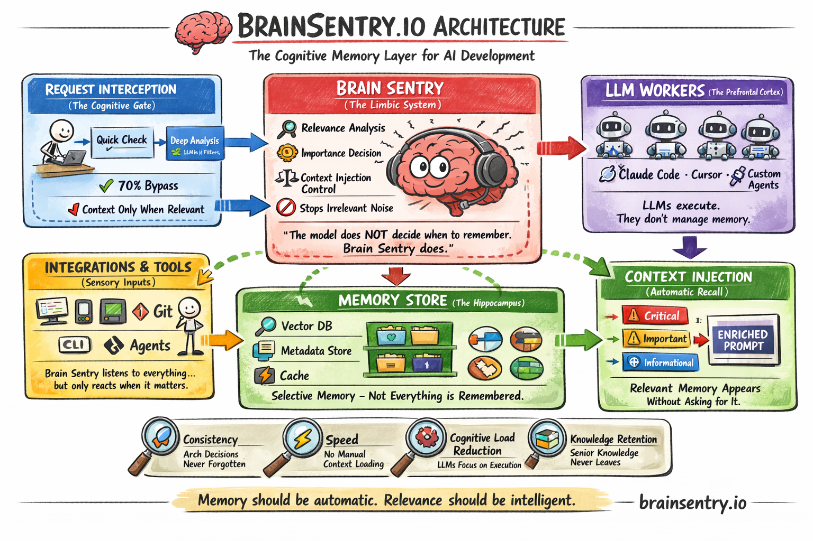
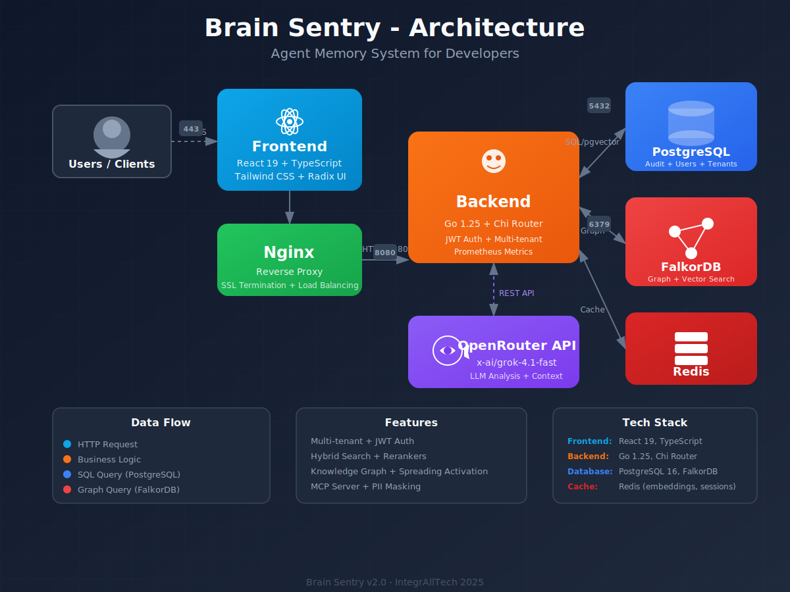

# Brain Sentry

> Agent Memory System for Developers - Memória persistente, autônoma e inteligente para aplicações de IA

[](https://openjdk.org/)
[](https://spring.io/projects/spring-boot)
[](https://react.dev/)
[](https://www.typescriptlang.org/)
[](LICENSE)

---

## Table of Contents

- [Overview](#overview)
- [Architecture](#architecture)
- [Tech Stack](#tech-stack)
- [Project Structure](#project-structure)
- [Quick Start](#quick-start)
- [Configuration](#configuration)
- [API Documentation](#api-documentation)
- [Development](#development)
- [Testing](#testing)
- [Deployment](#deployment)
- [Status](#status)

---

## Overview

**Brain Sentry** é um sistema de gerenciamento de contexto para aplicações de IA que funciona como "memória de longo prazo" para agentes de IA. Ao contrário de sistemas tradicionais de RAG, o Brain Sentry oferece:

- **4 Tipos de Memória**: Semntica, Episdica, Procedural e Associativa
- **Graph-Native Storage**: Relacionamentos entre memrias so nativos via FalkorDB
- **Busca Semntica**: Vector search com embeddings (384 dimenses)
- **Multi-tenant**: Suporte completo a multi-tenancy
- **Audit Trail**: Rastreabilidade completa de todas as operaes
- **Interceptao de Prompts**: Injeo automtica de contexto relevante

### Problem Statement

- Modelos de IA esquecem contexto de conversas anteriores
- Padres de cdigo no so seguidos consistentemente
- Conhecimento do projeto se perde ao longo do tempo
- Contexto irrelevante  injetado em prompts

### Solution

- Memria estruturada em graph database (FalkorDB)
- Anlise inteligente com LLM (via OpenRouter)
- Injeo automtica de contexto relevante
- Auditvel e corrigvel

### Infogrfico do Sistema



---

## Architecture



### Componentes

| Componente | Tecnologia | Porta | Descrio |
|------------|-----------|-------|----------|
| Frontend | React 18 + Vite | 80 | Interface web administrativa |
| Backend | Spring Boot 3.2 | 8080 | API REST |
| PostgreSQL | PostgreSQL 16 | 5432 | Audit logs, users, tenants |
| FalkorDB | FalkorDB Latest | 6379 | Graph + Vector database |
| Nginx | Nginx Alpine | 443/80 | Reverse proxy (produo) |
| Redis | Redis 7 | 6379 | Cache de embeddings (opcional) |

---

## Tech Stack

### Backend
```yaml
Language:     Java 21
Framework:    Spring Boot 3.2
Build:        Maven 3.9+
Database:     PostgreSQL 16 (JPA/Hibernate)
              FalkorDB (Graph + Vector)
LLM:          OpenRouter (x-ai/grok-4.1-fast)
Embeddings:   all-MiniLM-L6-v2 (384 dim)
Security:     JWT + BCrypt
Cache:        Redis (Spring Cache)
Metrics:      Micrometer + Prometheus
Health:       Spring Boot Actuator
Docs:         OpenAPI 3.0 (SpringDoc)
```

### Frontend
```yaml
Framework:    React 19 + Vite
Language:     TypeScript 5.3
UI Library:   Radix UI (headless)
Styling:      Tailwind CSS
State:        React Context
HTTP Client:  Fetch API
Auth:         JWT (localStorage)
Theme:        Dark/Light/System
Landing:      Multi-language (EN/PT/ES)
```

### DevOps
```yaml
Container:    Docker
Compose:      Docker Compose
Proxy:        Nginx Alpine
Monitoring:   Prometheus (endpoint)
Health:       /actuator/health
```

---

## Project Structure

```
brainsentry.io/
├── brain-sentry-backend/          # Backend Spring Boot
│   ├── src/
│   │   ├── main/
│   │   │   ├── java/com/integraltech/brainsentry/
│   │   │   │   ├── config/       # Configuraes (Security, DB, Cache, etc)
│   │   │   │   ├── controller/   # REST Controllers
│   │   │   │   │   ├── CompressionController.java
│   │   │   │   │   ├── NoteTakingController.java
│   │   │   │   │   └── ...
│   │   │   │   ├── service/      # Business Logic
│   │   │   │   │   ├── ArchitectService.java      # Context compression
│   │   │   │   │   ├── NoteTakingService.java    # Session analysis
│   │   │   │   │   ├── OpenRouterService.java
│   │   │   │   │   └── ...
│   │   │   │   ├── repository/   # JPA Repositories
│   │   │   │   │   ├── HindsightNoteJpaRepository.java
│   │   │   │   │   └── ...
│   │   │   │   ├── domain/       # Entities (JPA)
│   │   │   │   │   ├── HindsightNote.java
│   │   │   │   │   ├── Memory.java
│   │   │   │   │   └── ...
│   │   │   │   ├── dto/          # Request/Response DTOs
│   │   │   │   │   ├── request/
│   │   │   │   │   │   ├── CompressionRequest.java
│   │   │   │   │   │   ├── SessionAnalysisRequest.java
│   │   │   │   │   │   └── CreateHindsightNoteRequest.java
│   │   │   │   │   └── response/
│   │   │   │   │       ├── CompressedContextResponse.java
│   │   │   │   │       ├── SessionAnalysisResponse.java
│   │   │   │   │       └── HindsightNoteResponse.java
│   │   │   │   └── mapper/       # DTO Mappers
│   │   │   └── resources/
│   │   │       ├── application.yml
│   │   │       └── application-prod.yml
│   │   └── test/                 # Unit & Integration Tests
│   │       └── java/
│   │           └── .../
│   │               ├── ArchitectServiceTest.java
│   │               └── NoteTakingServiceTest.java
│   ├── Dockerfile
│   └── pom.xml
│
├── brain-sentry-frontend/         # Frontend React
│   ├── src/
│   │   ├── components/
│   │   │   ├── ui/              # Componentes UI reutilizáveis
│   │   │   ├── layout/          # Layout components
│   │   │   └── ...              # Domain components
│   │   ├── landing/             # Landing Page (multi-language)
│   │   │   ├── components/      # Hero, Features, Research, etc
│   │   │   ├── contexts/        # Language context
│   │   │   └── pages/           # LandingPage.tsx
│   │   ├── pages/               # Página da aplicação
│   │   ├── contexts/            # React Context (Auth, Theme)
│   │   ├── lib/                 # Utilities
│   │   └── main.tsx
│   ├── public/
│   │   └── images/              # Logos and assets
│   ├── docker/
│   │   └── nginx.conf
│   ├── Dockerfile
│   └── package.json
│
├── documents/                     # Documentao do projeto
│   ├── 00-PROJECT-OVERVIEW.md
│   ├── BACKEND_SPECIFICATION.md
│   ├── FRONTEND_SPECIFICATION.md
│   └── ...
│
├── docker-compose.yml             # Development environment
├── docker-compose.production.yml  # Production environment
├── .env.example                   # Exemplo de variveis de ambiente
└── README.md                      # Este arquivo
```

---

## Quick Start

### Prerequisites

- **Java**: 21+
- **Maven**: 3.9+
- **Node.js**: 18+
- **Docker**: 20.10+ / Docker Compose: 2.20+
- **OpenRouter API Key**: [https://openrouter.ai/](https://openrouter.ai/)

### Development Setup

#### 1. Clone o Repositório

```bash
git clone https://github.com/edsonmartins/brainsentry.io.git
cd brainsentry.io
```

#### 2. Configure as Variveis de Ambiente

```bash
cp .env.example .env
# Edite .env com suas configuraes
```

```bash
# Database
POSTGRES_DB=brainsentry
POSTGRES_USER=brainsentry
POSTGRES_PASSWORD=your_secure_password

# FalkorDB
FALKORDB_PASSWORD=

# OpenRouter API
OPENROUTER_API_KEY=your_openrouter_api_key

# Security
JWT_SECRET=your_jwt_secret_min_32_chars

# Spring Profiles
SPRING_PROFILES_ACTIVE=dev
```

#### 3. Suba os Servios de Banco de Dados

```bash
docker-compose up -d postgres falkordb
```

#### 4. Inicie o Backend

```bash
cd brain-sentry-backend
mvn clean install
mvn spring-boot:run
```

O backend estar disponvel em `http://localhost:8080`

#### 5. Inicie o Frontend (Development)

```bash
cd brain-sentry-frontend
npm install
npm run dev
```

O frontend estar disponvel em `http://localhost:5173`

### Production Setup

#### 1. Build as Imagens Docker

```bash
cd brain-sentry-backend
docker build -t brainsentry-backend:latest .

cd ../brain-sentry-frontend
docker build -t brainsentry-frontend:latest .
```

#### 2. Suba o Stack de Produo

```bash
cd ..
docker-compose -f docker-compose.production.yml up -d
```

#### 3. Verifique os Servios

```bash
docker-compose -f docker-compose.production.yml ps
```

Acesse:
- Frontend: `http://localhost`
- Backend API: `http://localhost:8080/api`
- Health Check: `http://localhost:8080/actuator/health`
- Prometheus Metrics: `http://localhost:8080/actuator/prometheus`
- API Docs (Swagger): `http://localhost:8080/swagger-ui.html`

---

## Configuration

### Backend Configuration

As configuraes principais esto em `application.yml`:

```yaml
# Database
spring:
  datasource:
    url: jdbc:postgresql://${POSTGRES_HOST:localhost}:${POSTGRES_PORT:5432}/${POSTGRES_DB:brainsentry}
    username: ${POSTGRES_USER:brainsentry}
    password: ${POSTGRES_PASSWORD}

  # JPA/Hibernate
  jpa:
    hibernate:
      ddl-auto: update
    show-sql: true

  # Redis Cache
  redis:
    host: ${REDIS_HOST:localhost}
    port: ${REDIS_PORT:6379}

# FalkorDB
falkordb:
  host: ${FALKORDB_HOST:localhost}
  port: ${FALKORDB_PORT:6379}
  password: ${FALKORDB_PASSWORD:}

# OpenRouter
openrouter:
  api-key: ${OPENROUTER_API_KEY}
  model: ${LLM_MODEL:x-ai/grok-4.1-fast}
  base-url: https://openrouter.ai/api/v1

# JWT
jwt:
  secret: ${JWT_SECRET}
  expiration: 86400000  # 24h

# Actuator
management:
  endpoints:
    web:
      exposure:
        include: health,info,metrics,prometheus
```

### Frontend Configuration

```typescript
// src/config/api.ts
export const API_BASE_URL = import.meta.env.VITE_API_URL || 'http://localhost:8080/api';

// Environment variables (.env)
VITE_API_URL=http://localhost:8080/api
```

---

## API Documentation

### Base URL

```
Production:  http://localhost:8080/api
Development: http://localhost:8080/api
```

### Authentication

Todos os endpoints (exceto login) requerem autenticao via JWT:

```bash
curl -H "Authorization: Bearer <token>" \
  http://localhost:8080/api/v1/memories
```

### Main Endpoints

#### Memories

| Method | Endpoint | Description |
|--------|----------|-------------|
| POST | `/v1/memories` | Create memory |
| GET | `/v1/memories` | List memories (paginated) |
| GET | `/v1/memories/{id}` | Get memory by ID |
| PUT | `/v1/memories/{id}` | Update memory |
| DELETE | `/v1/memories/{id}` | Delete memory |
| POST | `/v1/memories/search` | Semantic search |
| GET | `/v1/memories/{id}/related` | Find related memories |

#### Interception

| Method | Endpoint | Description |
|--------|----------|-------------|
| POST | `/v1/intercept` | Intercept and enhance prompt |

#### Relationships

| Method | Endpoint | Description |
|--------|----------|-------------|
| POST | `/v1/relationships` | Create relationship |
| GET | `/v1/relationships/{memoryId}` | Get relationships |
| DELETE | `/v1/relationships/{id}` | Delete relationship |

#### Users & Tenants

| Method | Endpoint | Description |
|--------|----------|-------------|
| GET | `/v1/users` | List users |
| POST | `/v1/users` | Create user |
| PATCH | `/v1/users/{id}` | Update user |
| GET | `/v1/tenants` | List tenants |
| POST | `/v1/tenants` | Create tenant |

#### Audit & Stats

| Method | Endpoint | Description |
|--------|----------|-------------|
| GET | `/v1/audit-logs` | List audit logs |
| GET | `/v1/stats/overview` | System overview |
| GET | `/actuator/health` | Health check |

#### Notes (Note-Taking Agent)

| Method | Endpoint | Description |
|--------|----------|-------------|
| POST | `/v1/notes/analyze` | Analyze session and extract insights |
| GET | `/v1/notes/session/{id}` | Get notes for a session |
| GET | `/v1/notes/session/{id}/md` | Export session notes as Markdown |
| POST | `/v1/notes/hindsight` | Create hindsight note manually |
| GET | `/v1/notes/hindsight` | List hindsight notes for tenant |
| GET | `/v1/notes/hindsight/frequent` | Get frequent errors |
| GET | `/v1/notes/insights` | Get insight notes for tenant |
| POST | `/v1/notes/distill` | Distill session into persistent memories |

#### Compression (Architect Agent)

| Method | Endpoint | Description |
|--------|----------|-------------|
| POST | `/v1/compression/compress` | Compress conversation context |
| POST | `/v1/compression/summary` | Extract structured summary from messages |
| POST | `/v1/compression/check` | Check if compression is needed |
| POST | `/v1/compression/critical` | Identify critical messages |
| GET | `/v1/compression/status` | Get compression status for tenant |

### OpenAPI/Swagger

A documentao interativa da API est disponvel em:

```
http://localhost:8080/swagger-ui.html
http://localhost:8080/api-docs
```

---

## Development

### Backend Development

```bash
# Run tests
mvn test

# Run with coverage
mvn test jacoco:report

# Run specific test
mvn test -Dtest=MemoryServiceTest

# Package without tests
mvn package -DskipTests

# Run locally
mvn spring-boot:run

# Debug mode
mvn spring-boot:run -Dspring-boot.run.jvmArguments="-agentlib:jdwp=transport=dt_socket,server=y,suspend=n,address=5005"
```

### Frontend Development

```bash
# Install dependencies
npm install

# Run dev server
npm run dev

# Run tests
npm run test

# Build for production
npm run build

# Preview production build
npm run preview

# Lint
npm run lint
```

### Code Style

- **Backend**: Seguir padres Spring Boot, usar Lombok onde aplicvel
- **Frontend**: ESLint + Prettier configurados

---

## Testing

### Backend Tests

```bash
cd brain-sentry-backend

# All tests
mvn test

# Unit tests only
mvn test -Dgroups=unit

# Integration tests only
mvn test -Dgroups=integration

# With coverage report
mvn test jacoco:report
open target/site/jacoco/index.html
```

**Test Coverage**: 130+ testes

| Tipo | Quantidade |
|------|------------|
| Unitrios | 105 |
| E2E | 38 |
| Segurana | 13 |
| Performance | 9 |

### Frontend Tests

```bash
cd brain-sentry-frontend

# Run tests
npm run test

# Run with coverage
npm run test:coverage
```

---

## Deployment

### Docker Deployment

#### Backend

```bash
cd brain-sentry-backend
docker build -t brainsentry-backend:latest .
docker run -p 8080:8080 \
  -e POSTGRES_HOST=postgres \
  -e FALKORDB_HOST=falkordb \
  -e OPENROUTER_API_KEY=your_key \
  brainsentry-backend:latest
```

#### Frontend

```bash
cd brain-sentry-frontend
docker build -t brainsentry-frontend:latest .
docker run -p 80:80 brainsentry-frontend:latest
```

### Docker Compose (Full Stack)

```bash
# Development
docker-compose up -d

# Production
docker-compose -f docker-compose.production.yml up -d

# With Nginx proxy
docker-compose -f docker-compose.production.yml --profile with-nginx up -d

# Scale backend
docker-compose -f docker-compose.production.yml up -d --scale backend=3
```

### Environment Variables for Production

```bash
# Required
POSTGRES_PASSWORD=secure_password
JWT_SECRET=min_32_characters_secret
OPENROUTER_API_KEY=your_api_key

# Optional
SPRING_PROFILES_ACTIVE=prod
LOG_LEVEL=INFO
```

### Health Checks

```bash
# Backend health
curl http://localhost:8080/actuator/health

# Detailed health
curl http://localhost:8080/actuator/health/db
curl http://localhost:8080/actuator/health/falkordb
curl http://localhost:8080/actuator/health/openrouter
curl http://localhost:8080/actuator/health/embedding

# Prometheus metrics
curl http://localhost:8080/actuator/prometheus
```

---

## Status

### Implementation Status

**Backend**: 100% completo
- Entities & Repositories
- Services & Controllers
- Security (JWT + BCrypt)
- Cache (Redis)
- Metrics (Prometheus)
- Health Checks
- OpenAPI Documentation

**Frontend**: 95% completo
- 10 pginas principais
- 10+ componentes UI
- Autenticao JWT
- Tema Dark/Light
- Pending: Rich text editor

**Infrastructure**: 100% completo
- Dockerfiles
- docker-compose production
- Nginx configuration

### Roadmap

| Phase | Status | Description |
|-------|--------|-------------|
| Phase 1 | DONE | CRUD + Setup |
| Phase 2 | DONE | LLM + Vector Search |
| Phase 3 | DONE | Relationships + Versioning |
| Phase 4 | DONE | Audit + Analytics |
| Phase 5 | DONE | Advanced Features |
| Phase 6 | DONE | Polish + Deploy |

---

## License

Apache License 2.0 - Copyright 2025 Edson Martins

---

## Support

For issues, questions, or contributions, please visit:

**GitHub**: https://github.com/edsonmartins/brainsentry.io

---

**Built with  for developers building AI agents**
