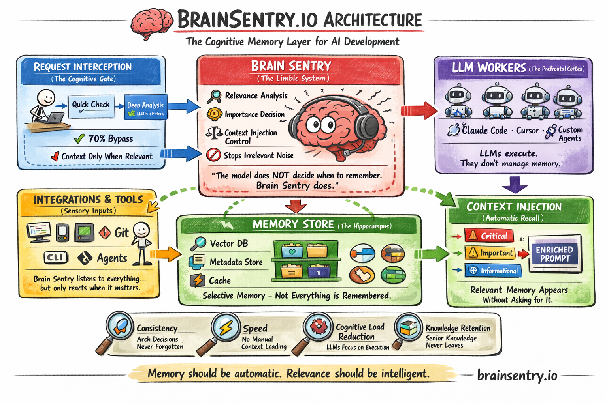
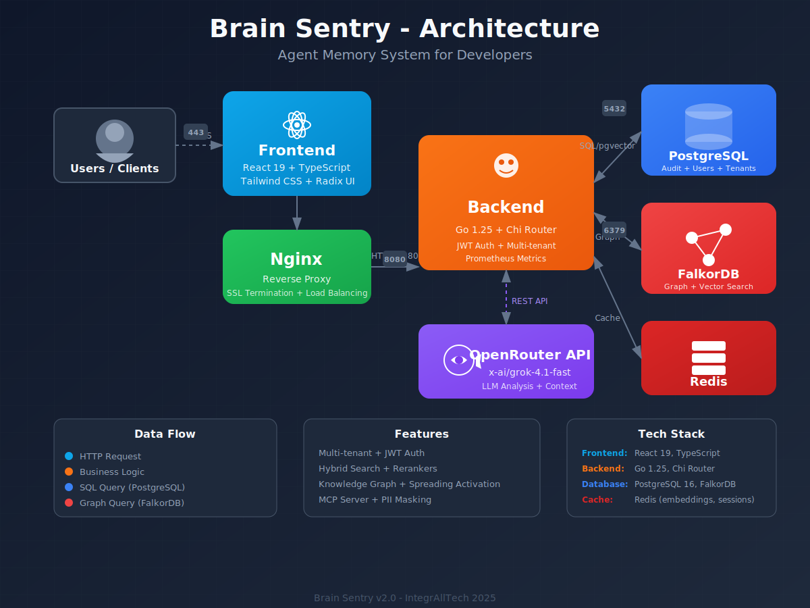

# Brain Sentry

> Agent Memory System for Developers - Memória persistente, autônoma e inteligente para aplicações de IA

[](https://go.dev/)
[](https://react.dev/)
[](https://www.typescriptlang.org/)
[](LICENSE)

---

## Table of Contents

- [Overview](#overview)
- [Architecture](#architecture)
- [Tech Stack](#tech-stack)
- [Project Structure](#project-structure)
- [Quick Start](#quick-start)
- [Configuration](#configuration)
- [API Documentation](#api-documentation)
- [Development](#development)
- [Testing](#testing)
- [Deployment](#deployment)
- [Status](#status)

---

## Overview

**Brain Sentry** é um sistema de gerenciamento de contexto para aplicações de IA que funciona como "memória de longo prazo" para agentes de IA. Ao contrário de sistemas tradicionais de RAG, o Brain Sentry oferece:

- **8 Tipos de Memória**: Semântica, Episódica, Procedural, Personalidade, Preferência, Thread, Task e Emoção
- **Graph-Native Storage**: Relacionamentos entre memórias são nativos via FalkorDB
- **Busca Semântica**: Vector search com embeddings (384 dimensões) + scoring híbrido composto
- **Multi-tenant**: Suporte completo a multi-tenancy
- **Audit Trail**: Rastreabilidade completa de todas as operações
- **Interceptação de Prompts**: Injeção automática de contexto relevante com budget de tokens
- **Modelo Cognitivo**: Decaimento temporal, spreading activation, reflexão automática, reconciliação de fatos
- **MCP Protocol**: Integração nativa com agentes de IA via JSON-RPC 2.0 + SSE

### Problema

- Modelos de IA esquecem contexto de conversas anteriores
- Padrões de código não são seguidos consistentemente
- Conhecimento do projeto se perde ao longo do tempo
- Contexto irrelevante é injetado em prompts
- Dados sensíveis vazam para APIs de LLM externas

### Solução

- Memória estruturada em graph database (FalkorDB)
- Análise inteligente com LLM (via OpenRouter)
- Injeção automática de contexto relevante com budget de tokens
- Auditável e corrigível
- Detecção e mascaramento de PII antes de enviar ao LLM
- Aprendizado cross-session com reflexão automática

### Infográfico do Sistema



---

## Architecture



### Componentes

| Componente | Tecnologia | Porta | Descrição |
|------------|-----------|-------|----------|
| Frontend | React 19 + Vite | 80 | Interface web administrativa |
| Backend | Go 1.25 + Chi | 8080 | API REST + MCP Server |
| PostgreSQL | PostgreSQL 16 + pgvector | 5432 | Memórias, audit logs, users, tenants |
| FalkorDB | FalkorDB Latest | 6379 | Knowledge graph + vector database |
| Redis | Redis 7 | 6379 | Cache de embeddings + task scheduler |
| Nginx | Nginx Alpine | 443/80 | Reverse proxy (produção) |

---

## Tech Stack

### Backend
```yaml
Language:     Go 1.25
Router:       Chi
Database:     PostgreSQL 16 + pgvector
              FalkorDB (Graph + Cypher)
Cache:        Redis 7 (go-redis/v9)
LLM:          OpenRouter (multiple models)
Embeddings:   all-MiniLM-L6-v2 (384 dim)
Security:     JWT + BCrypt + PII masking
Metrics:      Prometheus
Protocol:     MCP (JSON-RPC 2.0 + SSE)
Binary:       12 MB, <100ms startup, ~20-50 MB RAM
```

### Frontend
```yaml
Framework:    React 19 + Vite
Language:     TypeScript 5.3
UI Library:   Radix UI (headless)
Styling:      Tailwind CSS
State:        React Context
HTTP Client:  Fetch API
Auth:         JWT (localStorage)
Theme:        Dark/Light/System
Landing:      Multi-language (EN/PT/ES)
```

### DevOps
```yaml
Container:    Docker
Compose:      Docker Compose
Proxy:        Nginx Alpine
Monitoring:   Prometheus (/metrics)
Health:       /health
```

---

## Project Structure

```
brainsentry.io/
├── brain-sentry-go/               # Backend Go
│   ├── cmd/server/                # Entrypoint, dependency wiring
│   ├── internal/
│   │   ├── cache/                 # Redis cache layer
│   │   ├── config/                # YAML + env config
│   │   ├── domain/                # Domain models, enums, value objects
│   │   ├── dto/                   # Request/Response DTOs
│   │   ├── handler/               # HTTP handlers (Chi router)
│   │   ├── mcp/                   # MCP protocol server (JSON-RPC 2.0)
│   │   ├── middleware/            # Auth, CORS, Tenant, Rate Limit, Metrics
│   │   ├── repository/
│   │   │   ├── postgres/          # PostgreSQL repositories + migrations
│   │   │   └── graph/             # FalkorDB graph repositories
│   │   └── service/               # Business logic (38 service files)
│   │       ├── memory.go          # Core CRUD + hybrid search
│   │       ├── interception.go    # Context injection pipeline
│   │       ├── scoring.go         # Composite hybrid scoring
│   │       ├── classifier.go      # Auto memory type classification
│   │       ├── decay.go           # Temporal decay computation
│   │       ├── reconciliation.go  # LLM fact reconciliation
│   │       ├── retrieval_planner.go # Intent-aware retrieval
│   │       ├── profile.go         # User profile generation
│   │       ├── reflection.go      # Automatic reflection loop
│   │       ├── spreading_activation.go # Graph activation propagation
│   │       ├── nl_cypher.go       # Natural language to Cypher
│   │       ├── louvain.go         # Community detection
│   │       ├── cross_session.go   # Cross-session pipeline
│   │       ├── task_scheduler.go  # Redis Streams scheduler
│   │       ├── connector.go       # External connectors
│   │       ├── benchmark.go       # Benchmarking framework
│   │       ├── circuitbreaker.go  # Circuit breaker pattern
│   │       ├── reranker.go        # Pluggable rerankers
│   │       └── ...                # + 20 more service files
│   ├── pkg/tenant/                # Tenant context utilities
│   ├── config.yaml
│   ├── Dockerfile
│   └── Makefile
│
├── brain-sentry-frontend/         # Frontend React
│   ├── src/
│   │   ├── components/
│   │   │   ├── ui/                # Componentes UI reutilizáveis
│   │   │   ├── layout/            # Layout components
│   │   │   └── ...                # Domain components
│   │   ├── landing/               # Landing Page (multi-language)
│   │   ├── pages/                 # Páginas da aplicação
│   │   ├── contexts/              # React Context (Auth, Theme)
│   │   ├── lib/                   # Utilities
│   │   └── main.tsx
│   ├── Dockerfile
│   └── package.json
│
├── documents/                     # Documentação do projeto
│   ├── 00-PROJECT-OVERVIEW.md
│   ├── BACKEND_SPECIFICATION.md
│   ├── FRONTEND_SPECIFICATION.md
│   └── ...
│
├── docker-compose.yml             # Development environment
├── docker-compose.production.yml  # Production environment
├── .env.example                   # Exemplo de variáveis de ambiente
└── README.md                      # Este arquivo
```

---

## Quick Start

### Prerequisites

- **Go**: 1.25+
- **Node.js**: 18+
- **Docker**: 20.10+ / Docker Compose: 2.20+
- **OpenRouter API Key**: [https://openrouter.ai/](https://openrouter.ai/)

### Development Setup

#### 1. Clone o Repositório

```bash
git clone https://github.com/edsonmartins/brainsentry.io.git
cd brainsentry.io
```

#### 2. Configure as Variáveis de Ambiente

```bash
cp .env.example .env
# Edite .env com suas configurações
```

```bash
# Database
POSTGRES_DB=brainsentry
POSTGRES_USER=brainsentry
POSTGRES_PASSWORD=your_secure_password

# FalkorDB
FALKORDB_PASSWORD=

# OpenRouter API
BRAINSENTRY_AI_AGENTIC_MODEL_API_KEY=your_openrouter_api_key

# Security
JWT_SECRET=your_jwt_secret_min_32_chars
```

#### 3. Suba os Serviços de Infraestrutura

```bash
docker-compose up -d postgres falkordb redis
```

#### 4. Inicie o Backend

```bash
cd brain-sentry-go
make dev
```

O backend estará disponível em `http://localhost:8080`

#### 5. Inicie o Frontend

```bash
cd brain-sentry-frontend
npm install
npm run dev
```

O frontend estará disponível em `http://localhost:5173`

### Production Setup

#### 1. Build as Imagens Docker

```bash
cd brain-sentry-go
docker build -t brainsentry-backend:latest .

cd ../brain-sentry-frontend
docker build -t brainsentry-frontend:latest .
```

#### 2. Suba o Stack de Produção

```bash
cd ..
docker-compose -f docker-compose.production.yml up -d
```

#### 3. Verifique os Serviços

```bash
docker-compose -f docker-compose.production.yml ps
```

Acesse:
- Frontend: `http://localhost`
- Backend API: `http://localhost:8080/api`
- Health Check: `http://localhost:8080/health`
- Prometheus Metrics: `http://localhost:8080/metrics`
- API Docs: `http://localhost:8080/swagger.json`

---

## Configuration

As configurações principais estão em `brain-sentry-go/config.yaml` com overrides via variáveis de ambiente:

| Variável | Descrição | Default |
|----------|-----------|---------|
| `DB_HOST` | Host do PostgreSQL | `localhost` |
| `DB_PORT` | Porta do PostgreSQL | `5432` |
| `DB_NAME` | Nome do banco | `brainsentry` |
| `DB_USER` | Usuário do banco | `brainsentry` |
| `DB_PASSWORD` | Senha do banco | `brainsentry` |
| `REDIS_ADDR` | Endereço do Redis | `localhost:6379` |
| `FALKORDB_HOST` | Host do FalkorDB | `localhost` |
| `FALKORDB_PORT` | Porta do FalkorDB | `6379` |
| `JWT_SECRET` | Secret para JWT | (obrigatório) |
| `BRAINSENTRY_AI_AGENTIC_MODEL_API_KEY` | API key do OpenRouter | (opcional) |

### Frontend Configuration

```typescript
// src/config/api.ts
export const API_BASE_URL = import.meta.env.VITE_API_URL || 'http://localhost:8080/api';
```

---

## API Documentation

### Base URL

```
http://localhost:8080/api
```

### Autenticação

Todos os endpoints (exceto login) requerem autenticação via JWT:

```bash
curl -H "Authorization: Bearer <token>" \
  http://localhost:8080/api/v1/memories
```

### Endpoints Principais

#### Memórias

| Método | Endpoint | Descrição |
|--------|----------|-----------|
| POST | `/v1/memories` | Criar memória |
| GET | `/v1/memories` | Listar memórias (paginado) |
| GET | `/v1/memories/{id}` | Buscar memória por ID |
| PUT | `/v1/memories/{id}` | Atualizar memória |
| DELETE | `/v1/memories/{id}` | Deletar memória |
| POST | `/v1/memories/search` | Busca semântica + híbrida |
| GET | `/v1/memories/by-category/{category}` | Filtrar por categoria |
| GET | `/v1/memories/by-importance/{importance}` | Filtrar por importância |
| POST | `/v1/memories/{id}/feedback` | Registrar feedback |

#### Interceptação

| Método | Endpoint | Descrição |
|--------|----------|-----------|
| POST | `/v1/intercept` | Interceptar e enriquecer prompt |

#### Relacionamentos

| Método | Endpoint | Descrição |
|--------|----------|-----------|
| GET | `/v1/relationships` | Listar relacionamentos |
| POST | `/v1/relationships` | Criar relacionamento |
| POST | `/v1/relationships/bidirectional` | Criar bidirecional |
| GET | `/v1/relationships/{memoryId}/related` | Buscar memórias relacionadas |
| POST | `/v1/relationships/{memoryId}/suggest` | Auto-detectar relacionamentos |

#### Grafo de Entidades (FalkorDB)

| Método | Endpoint | Descrição |
|--------|----------|-----------|
| GET | `/v1/entity-graph/knowledge-graph` | Obter knowledge graph |
| GET | `/v1/entity-graph/search` | Buscar entidades |
| POST | `/v1/entity-graph/extract/{memoryId}` | Extrair entidades de memória |
| POST | `/v1/entity-graph/extract-batch` | Extração em batch |

#### Notas

| Método | Endpoint | Descrição |
|--------|----------|-----------|
| GET | `/v1/notes` | Listar notas |
| POST | `/v1/notes/analyze` | Analisar sessão |
| GET | `/v1/notes/hindsight` | Listar notas de hindsight |
| POST | `/v1/notes/hindsight` | Criar nota de hindsight |

#### Compressão

| Método | Endpoint | Descrição |
|--------|----------|-----------|
| POST | `/v1/compression/compress` | Comprimir contexto |
| GET | `/v1/compression/session/{sessionId}` | Obter resumos da sessão |

#### MCP (Model Context Protocol)

| Método | Endpoint | Descrição |
|--------|----------|-----------|
| POST | `/v1/mcp/message` | Mensagem JSON-RPC 2.0 |
| POST | `/v1/mcp/sse` | Transporte SSE |
| POST | `/v1/mcp/batch` | Mensagens em batch |

#### Sistema

| Método | Endpoint | Descrição |
|--------|----------|-----------|
| GET | `/health` | Health check |
| GET | `/metrics` | Métricas Prometheus |
| GET | `/swagger.json` | Especificação OpenAPI |
| GET | `/v1/stats/overview` | Estatísticas do sistema |
| GET | `/v1/audit-logs` | Logs de auditoria |

### MCP Tools

O servidor MCP expõe estas ferramentas para agentes de IA:

| Ferramenta | Descrição |
|------------|-----------|
| `intercept_prompt` | Interceptar e enriquecer prompt com contexto |
| `create_memory` | Armazenar nova memória |
| `search_memories` | Buscar memórias (scoring híbrido) |
| `get_memory` | Recuperar memória específica |
| `list_memories` | Listar todas as memórias |
| `update_memory` | Atualizar memória |
| `delete_memory` | Deletar memória |

### MCP Prompts

| Prompt | Descrição |
|--------|-----------|
| `capture_pattern` | Capturar padrão ou prática de código |
| `extract_learning` | Extrair aprendizados de uma sessão |
| `summarize_discussion` | Resumir uma discussão |
| `context_builder` | Construir contexto para uma tarefa |
| `agent_context` | Contexto pronto para agente |
| `memory_summary` | Gerar resumo de memórias |
| `hindsight_review` | Revisar notas de hindsight |

---

## Features Cognitivas

Funcionalidades avançadas inspiradas em 13 projetos open-source de memória para IA:

| Feature | Descrição |
|---------|-----------|
| Classificação automática | 8 tipos de memória via pattern matching |
| Decaimento temporal | Taxas por tipo (personalidade: 0.001/dia, thread: 0.05/dia) |
| Supersessão temporal | `valid_from`/`valid_to` com invalidação automática |
| Scoring híbrido | Similaridade + BM25 + proximidade no grafo + recência + tags |
| Reconciliação de fatos | LLM extrai fatos atômicos e decide ADD/UPDATE/DELETE |
| Retrieval com reflexão | Multi-round gap-filling para 80% de cobertura |
| Perfil de usuário | Estático (fatos estáveis) + dinâmico (contexto recente) |
| Spreading activation | Propagação BFS com decaimento por hop no grafo |
| NL para Cypher | Tradução de linguagem natural para consultas de grafo |
| Louvain | Detecção de comunidades no grafo de memórias |
| Cross-session | Pipeline de aprendizado entre sessões com lifecycle hooks |
| Task scheduler | Redis Streams com prioridade por tenant e auto-recovery |
| Conectores externos | GitHub, Notion, Google Drive, Web Crawler |
| Benchmarking | Recall, Precision, F1, MRR, NDCG com datasets sintéticos |
| Circuit breaker | Resiliência para serviços externos (CLOSED/OPEN/HALF_OPEN) |
| PII detection | Mascaramento de dados sensíveis antes de enviar ao LLM |
| Rerankers plugáveis | NoOp, BM25, LLM-based, HybridScore |
| SimHash dedup | Deduplicação por Hamming distance |
| Reflexão automática | Clustering + síntese de insights de ordem superior |

---

## Development

### Backend

```bash
cd brain-sentry-go

# Run dev server
make dev

# Run tests
make test

# Run with coverage
make test-cover

# Run benchmarks
go test -bench=. ./internal/service/ -benchmem

# Build binary
make build

# Build Docker image
make docker-build
```

### Frontend

```bash
cd brain-sentry-frontend

# Install dependencies
npm install

# Run dev server
npm run dev

# Run tests
npm run test

# Build for production
npm run build

# Lint
npm run lint
```

---

## Testing

### Backend Tests

```bash
cd brain-sentry-go

# Todos os testes
make test

# Com cobertura
make test-cover

# Pacote específico
go test ./internal/service/ -v

# Testes de integração (requer Docker)
go test -tags=integration ./internal/repository/postgres/ -v
```

### Frontend Tests

```bash
cd brain-sentry-frontend

# Run tests
npm run test

# Run with coverage
npm run test:coverage
```

---

## Deployment

### Docker

```bash
# Backend
cd brain-sentry-go
docker build -t brainsentry-backend:latest .
docker run -p 8080:8080 \
  -e DB_HOST=postgres \
  -e FALKORDB_HOST=falkordb \
  -e REDIS_ADDR=redis:6379 \
  -e BRAINSENTRY_AI_AGENTIC_MODEL_API_KEY=your_key \
  -e JWT_SECRET=your_secret \
  brainsentry-backend:latest

# Frontend
cd ../brain-sentry-frontend
docker build -t brainsentry-frontend:latest .
docker run -p 80:80 brainsentry-frontend:latest
```

### Docker Compose (Full Stack)

```bash
# Development
docker-compose up -d

# Production
docker-compose -f docker-compose.production.yml up -d

# With Nginx proxy
docker-compose -f docker-compose.production.yml --profile with-nginx up -d
```

### Variáveis de Ambiente para Produção

```bash
# Obrigatórias
POSTGRES_PASSWORD=secure_password
JWT_SECRET=min_32_characters_secret
BRAINSENTRY_AI_AGENTIC_MODEL_API_KEY=your_api_key

# Opcionais
LOG_LEVEL=INFO
```

### Health Checks

```bash
curl http://localhost:8080/health
# {"status":"UP"}

curl http://localhost:8080/metrics
# Prometheus metrics
```

---

## Status

### Backend Go: 100% completo
- 38 service files, 164 arquivos totais, ~30.000 linhas
- Features cognitivas completas (Sprints A-E + Features Futuras)
- MCP protocol server (JSON-RPC 2.0 + SSE)
- Todos os testes passando
- Binário de 12 MB, startup <100ms, ~20-50 MB RAM

### Frontend: 95% completo
- 10 páginas principais
- 10+ componentes UI
- Autenticação JWT
- Tema Dark/Light/System
- Pending: Rich text editor

### Infraestrutura: 100% completo
- Dockerfiles
- docker-compose (dev + production)
- Nginx configuration

---

## License

Apache License 2.0 - Copyright 2025 Edson Martins

---

## Support

For issues, questions, or contributions:

**GitHub**: https://github.com/edsonmartins/brainsentry.io

---

**Built with care for developers building AI agents**
