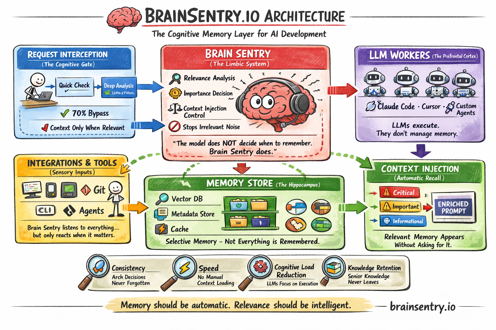
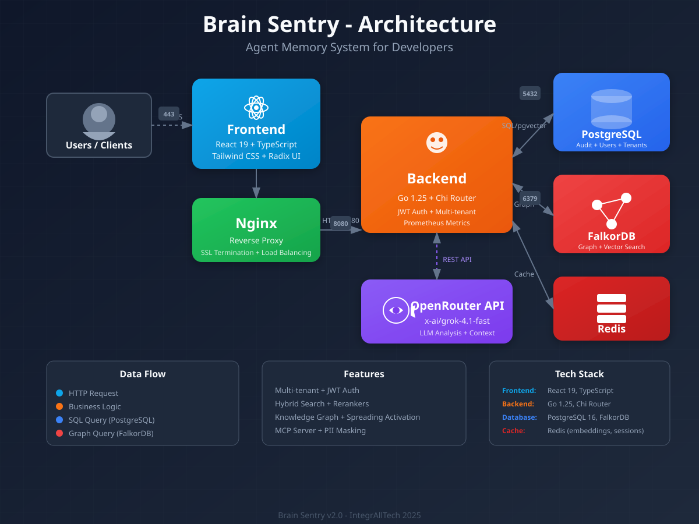

# Brain Sentry

> Agent Memory System for Developers - Memória persistente, autônoma e inteligente para aplicações de IA

[](https://go.dev/)
[](https://react.dev/)
[](https://www.typescriptlang.org/)
[](LICENSE)

---

## Table of Contents

- [Overview](#overview)
- [Como a memória funciona](#como-a-memória-funciona)
- [Matriz de Funcionalidades](#matriz-de-funcionalidades)
- [Architecture](#architecture)
- [Tech Stack](#tech-stack)
- [Project Structure](#project-structure)
- [Quick Start](#quick-start)
- [Configuration](#configuration)
- [API Documentation](#api-documentation)
- [Development](#development)
- [Testing](#testing)
- [Deployment](#deployment)
- [Status](#status)

---

## Overview

**Brain Sentry** é uma camada de memória persistente para agentes de IA. Ele recebe fatos, eventos, conversas e decisões; transforma esse conteúdo em memórias multi-tenant; recupera contexto por texto, embeddings, tempo e relacionamentos; e entrega esse contexto por REST, MCP ou interceptação de prompts.

O produto vai além de um RAG somente leitura porque também cria, atualiza, versiona, consolida, corrige, supersede e expira memórias. O PostgreSQL é a fonte canônica. FalkorDB, Redis, embeddings, comunidades e sumarizações são projeções derivadas ou caches reconstruíveis.

Capacidades centrais:

- memórias semânticas, episódicas, procedurais, preferências e contexto operacional;
- persistência canônica com tags, proveniência, validade temporal, feedback e soft delete;
- busca lexical, vetorial, temporal e por grafo, com score híbrido e fallback;
- injeção automática de contexto com limite de tokens e mascaramento de PII;
- relacionamentos, GraphRAG e spreading activation para recuperação associativa;
- reconciliação, consolidação, reflexão, conflito e retenção;
- isolamento por tenant, autenticação, auditoria e trust score explicável;
- integração por MCP JSON-RPC 2.0, SSE, REST, CLI, TUI e painel web.

Veja [O que o produto faz e suas capacidades](documents/PRODUCT_CAPABILITIES.md) para o contrato funcional e a [auditoria final e cobertura de testes](documents/FINAL_AUDIT_AND_TEST_COVERAGE.md) para as evidências e limites verificados. Documentos que descrevem Java/Spring, Next.js ou FalkorDB como fonte primária são históricos e não representam a arquitetura atual.

### Problema

- Modelos de IA esquecem contexto de conversas anteriores
- Padrões de código não são seguidos consistentemente
- Conhecimento do projeto se perde ao longo do tempo
- Contexto irrelevante é injetado em prompts
- Dados sensíveis vazam para APIs de LLM externas

### Solução

- memória canônica no PostgreSQL, separada das projeções derivadas;
- enriquecimento opcional por LLM e embeddings;
- recuperação híbrida com degradação para busca textual;
- contexto injetado com budget, temporalidade, PII masking e framing de segurança;
- conhecimento corrigível por versionamento, feedback, supersessão e revisão;
- aprendizado cross-session, consolidação e reflexão.

### Infográfico do Sistema



---

## Como a memória funciona

```text
conteúdo recebido
      |
      v
privacy stripping -> classificação -> extração -> deduplicação
      |                                      |
      v                                      v
PostgreSQL canônico                 embeddings/grafo/eventos
      |                                      |
      +---------- retrieval híbrido <--------+
                         |
                         v
      filtro temporal -> ranking -> budget -> PII masking -> agente
```

| Forma | O que representa | Persistência |
|---|---|---|
| Semântica | Fatos, conceitos e conhecimento estável | Conteúdo canônico, resumo, tags e metadata; embedding derivado |
| Episódica | Eventos ligados a uma sessão ou instante | Memória com proveniência, `recorded_at` e referência de origem |
| Procedural | Regras, padrões e instruções | Memória tipada, opcionalmente com código e contexto |
| Preferência/personalidade | Características persistentes de usuário ou cliente | Tipo, confiança, proveniência e sinais de feedback |
| Operacional | Threads, tarefas, decisões, políticas, notas e incidentes | Memórias e entidades especializadas no PostgreSQL |
| Associativa | Relações entre memórias, entidades e conceitos | Arestas canônicas quando curadas e projeção FalkorDB para travessia |

Princípios:

- conteúdo humano ou registrado por agente é canônico no PostgreSQL;
- resultados recalculáveis de LLM, embedding e algoritmos de grafo são derivados;
- expiração e supersessão encerram validade sem apagar silenciosamente a história;
- toda operação do caminho principal é escopada pelo tenant autenticado;
- sem LLM ou FalkorDB, o produto continua com menos enriquecimento e recall semântico/associativo.

---

## Matriz de Funcionalidades

Visão consolidada do que o Brain Sentry faz hoje:

- **Disponível**: implementado no caminho principal sem dependência opcional.
- **Condicional**: depende de LLM, embedding, Redis ou FalkorDB.
- **Parcial**: existe, mas ainda não satisfaz completamente o contrato pretendido.

### Núcleo de Memória

| Funcionalidade | Status | Endpoint / Onde |
|---|---|---|
| CRUD, filtros e paginação | Disponível | `/v1/memories` |
| Busca lexical e score híbrido | Disponível | `POST /v1/memories/search` |
| Busca vetorial e GraphRAG | Condicional | Requer embedding e FalkorDB atualizado |
| Versionamento + rollback | Disponível | Snapshot, auditoria e outbox persistidos na transação canônica |
| Feedback, flag e review | Disponível | Endpoints por memória |
| SimHash e idempotência por origem | Disponível | Automático no create |
| Store plugável | Parcial | Embedded oferece apenas CRUD e busca textual básica |

### Inteligência de Memória (v0.2.0 — inspirado no comparativo memanto)

| Funcionalidade | Status | Endpoint / Onde |
|---|---|---|
| Provenance tipado (6 níveis) | ✅ | campo `provenance` em create/response |
| Trust score explicável (0-1 + label + razões) | ✅ | `GET /v1/memories/{id}/trust` |
| Ingestão de documentos (txt/md/csv/json/docx) | ✅ | `POST /v1/memories/upload` |
| Resolução interativa de conflitos | ✅ 🔑 | `POST /v1/conflicts/resolve` |
| Detecção de conflitos / quase-duplicatas | ✅ 🔑 | `/v1/conflicts/detect|scan|near-duplicates` |
| Benchmark de retrieval reprodutível | ✅ | `brain-sentry-explorer: npm run benchmark` |

### Temporalidade e validade

| Funcionalidade | Status | Endpoint / Onde |
|---|---|---|
| Decaimento temporal por tipo | Disponível | Aplicado no ranking |
| Validade e supersessão | Parcial | Campos implementados; automação requer endurecimento |
| Consulta `as-of` | Disponível | Reconstrói versões em `memory_history` pelos tempos válido e de sistema |
| Sync incremental | Disponível | `GET /v1/memories/changed-since` |
| Recall temporal pt-BR/en | Disponível | Integrado ao interceptador |
| Export de proveniência W3C PROV-O | Disponível | `/v1/export/provenance` |

### Grafo de Conhecimento

| Funcionalidade | Status | Endpoint / Onde |
|---|---|---|
| Relacionamentos entre memórias | ✅ | `/v1/relationships` |
| Auto-detecção de relacionamentos | ✅ 🔑 | `POST /v1/relationships/{id}/suggest` |
| Grafo Global | ✅ 🧩 | Memórias e relações canônicas do PostgreSQL, relações derivadas do FalkorDB e comunidades sobre o mapa filtrado |
| Ego-grafo | ✅ 🧩 | Vizinhança multi-hop combinando relações canônicas e projeção derivada |
| Grafo Temporal | ✅ | Versões de `memory_history`, transições de versão e supersessões entre memórias |
| Extração de entidades | ✅ 🔑🧩 | `/v1/entity-graph/*` |
| Detecção de comunidades (Louvain) | ✅ 🧩 | `/v1/graph/communities` |
| NL → Cypher | ✅ 🔑🧩 | `/v1/graph/nl-query` |
| Spreading activation | ✅ 🧩 | `/v1/memories/activate` |
| Sincronização incremental PostgreSQL → FalkorDB | Parcial | Rebuild disponível; escrita normal ainda não atualiza toda projeção |

### Governança & Semântica

| Funcionalidade | Status | Endpoint / Onde |
|---|---|---|
| Decisões (auditáveis) | ✅ 🗄️ | `/v1/decisions` |
| Políticas + enforcement | ✅ 🗄️ | `/v1/policies` |
| Eventos | ✅ 🗄️ | `/v1/events` |
| Raciocínio abdutivo | ✅ 🔑 | `/v1/reasoning/abduce` |
| Audit trail operacional | Parcial | Eventos disponíveis em `/v1/audit/*`; atomicidade com toda mutação ainda está em endurecimento |

### Agente & Integração

| Funcionalidade | Status | Endpoint / Onde |
|---|---|---|
| Interceptação de prompt (injeção de contexto) | ✅ 🔑 | `POST /v1/intercept` |
| Semantic API (remember/recall/improve/forget) | ✅ | `/v1/remember`, `/v1/recall`, ... |
| MCP (JSON-RPC 2.0 + SSE + batch) | ✅ | `/v1/mcp/*` |
| Traces de agente | ✅ | `/v1/traces` |
| Mesh P2P / Actions (multi-agente) | ✅ | `/v1/mesh/*`, `/v1/actions/*` |
| Webhooks | ✅ | `/v1/webhooks` |
| Conectores externos (GitHub/Notion/Drive) | ✅ | `/v1/connectors` |

### Segurança & Operação

| Funcionalidade | Status | Endpoint / Onde |
|---|---|---|
| Sanitizer de prompt-injection (14 patterns + framing) | ✅ | automático na injeção |
| Trust boundaries (Local/Subagent/Remote) | ✅ | middleware |
| PII detection + masking | ✅ | automático pré-LLM |
| Multi-tenancy (JWT + tenant) | ✅ | middleware |
| Fallback chain de LLM + circuit breaker | ✅ 🔑 | Anthropic > Gemini > OpenRouter |
| Tier routing de modelos | ✅ 🔑 | `/v1/models` |
| Diagnostics / health / version | ✅ | `/v1/diagnostics`, `/api/health`, `/api/version` |
| Eval harness (capture/replay + cross-modal) | ✅ | `/v1/eval/*` |

---

## Architecture



### Componentes

| Componente | Tecnologia | Porta | Descrição |
|------------|-----------|-------|----------|
| Frontend | React 19 + Vite | 80 | Interface web administrativa |
| Backend | Go 1.25 + Chi | 8080 | API REST + MCP Server |
| PostgreSQL | PostgreSQL 16 | 5432 | Fonte canônica: memórias, versões, auditoria, usuários e tenants |
| FalkorDB | FalkorDB Latest | 6379 | Projeção derivada: knowledge graph e busca vetorial |
| Redis | Redis 7 | 6379 | Cache de embeddings + task scheduler |
| Nginx | Nginx Alpine | 443/80 | Reverse proxy (produção) |

---

## Tech Stack

### Backend
```yaml
Language:     Go 1.25
Router:       Chi
Database:     PostgreSQL 16 (system of record)
              FalkorDB (graph + vector derivados)
Cache:        Redis 7 (go-redis/v9)
LLM:          OpenRouter (multiple models)
Embeddings:   all-MiniLM-L6-v2 (384 dim)
Security:     JWT + BCrypt + PII masking
Metrics:      Prometheus
Protocol:     MCP (JSON-RPC 2.0 + SSE)
Binary:       12 MB, <100ms startup, ~20-50 MB RAM
```

### Frontend
```yaml
Framework:    React 19 + Vite
Language:     TypeScript 5.3
UI Library:   Radix UI (headless)
Styling:      Tailwind CSS
State:        React Context
HTTP Client:  Fetch API
Auth:         JWT (localStorage)
Theme:        Dark/Light/System
Landing:      Multi-language (EN/PT/ES)
```

### DevOps
```yaml
Container:    Docker
Compose:      Docker Compose
Proxy:        Nginx Alpine
Monitoring:   Prometheus (/metrics)
Health:       /health
```

---

## Project Structure

```
brainsentry.io/
├── brain-sentry-go/               # Backend Go
│   ├── cmd/server/                # Entrypoint, dependency wiring
│   ├── internal/
│   │   ├── cache/                 # Redis cache layer
│   │   ├── config/                # YAML + env config
│   │   ├── domain/                # Domain models, enums, value objects
│   │   ├── dto/                   # Request/Response DTOs
│   │   ├── handler/               # HTTP handlers (Chi router)
│   │   ├── mcp/                   # MCP protocol server (JSON-RPC 2.0)
│   │   ├── middleware/            # Auth, CORS, Tenant, Rate Limit, Metrics
│   │   ├── repository/
│   │   │   ├── postgres/          # PostgreSQL repositories + migrations
│   │   │   └── graph/             # FalkorDB graph repositories
│   │   └── service/               # Business logic (76 service files)
│   │       ├── memory.go          # Core CRUD + hybrid search
│   │       ├── interception.go    # Context injection pipeline
│   │       ├── scoring.go         # Composite hybrid scoring
│   │       ├── classifier.go      # Auto memory type classification
│   │       ├── decay.go           # Temporal decay computation
│   │       ├── reconciliation.go  # LLM fact reconciliation
│   │       ├── retrieval_planner.go # Intent-aware retrieval
│   │       ├── profile.go         # User profile generation
│   │       ├── reflection.go      # Automatic reflection loop
│   │       ├── spreading_activation.go # Graph activation propagation
│   │       ├── nl_cypher.go       # Natural language to Cypher
│   │       ├── louvain.go         # Community detection
│   │       ├── cross_session.go   # Cross-session pipeline
│   │       ├── task_scheduler.go  # Redis Streams scheduler
│   │       ├── connector.go       # External connectors
│   │       ├── benchmark.go       # Benchmarking framework
│   │       ├── circuitbreaker.go  # Circuit breaker pattern
│   │       ├── reranker.go        # Pluggable rerankers
│   │       └── ...                # + 20 more service files
│   ├── pkg/tenant/                # Tenant context utilities
│   ├── config.yaml
│   ├── Dockerfile
│   └── Makefile
│
├── brain-sentry-frontend/         # Frontend React
│   ├── src/
│   │   ├── components/
│   │   │   ├── ui/                # Componentes UI reutilizáveis
│   │   │   ├── layout/            # Layout components
│   │   │   └── ...                # Domain components
│   │   ├── landing/               # Landing Page (multi-language)
│   │   ├── pages/                 # Páginas da aplicação
│   │   ├── contexts/              # React Context (Auth, Theme)
│   │   ├── lib/                   # Utilities
│   │   └── main.tsx
│   ├── Dockerfile
│   └── package.json
│
├── brain-sentry-explorer/         # Cliente TUI + suíte de validação E2E da API
│   ├── src/
│   │   ├── api/                   # Cliente HTTP tipado da API
│   │   ├── scenarios/             # Cenários de validação (107 steps)
│   │   ├── benchmark/             # Benchmark de retrieval reprodutível
│   │   └── cli.tsx                # npm run validate | benchmark | start
│   └── package.json
│
├── documents/                     # Documentação do projeto
│   ├── 00-PROJECT-OVERVIEW.md
│   ├── BACKEND_SPECIFICATION.md
│   ├── FRONTEND_SPECIFICATION.md
│   └── ...
│
├── docker-compose.yml             # Development environment
├── docker-compose.production.yml  # Production environment
├── .env.example                   # Exemplo de variáveis de ambiente
└── README.md                      # Este arquivo
```

---

## Quick Start

### Prerequisites

- **Go**: 1.25+
- **Node.js**: 18+
- **Docker**: 20.10+ / Docker Compose: 2.20+
- **OpenRouter API Key**: [https://openrouter.ai/](https://openrouter.ai/)

### Development Setup

#### 1. Clone o Repositório

```bash
git clone https://github.com/edsonmartins/brainsentry.io.git
cd brainsentry.io
```

#### 2. Configure as Variáveis de Ambiente

```bash
cp .env.example .env
# Edite .env com suas configurações
```

```bash
# Database
POSTGRES_DB=brainsentry
POSTGRES_USER=brainsentry
POSTGRES_PASSWORD=your_secure_password

# FalkorDB
FALKORDB_PASSWORD=

# OpenRouter API
BRAINSENTRY_AI_AGENTIC_MODEL_API_KEY=your_openrouter_api_key

# Security
JWT_SECRET=your_jwt_secret_min_32_chars
```

#### 3. Suba os Serviços de Infraestrutura

```bash
docker-compose up -d postgres falkordb redis
```

#### 4. Inicie o Backend

```bash
cd brain-sentry-go
make dev
```

O backend estará disponível em `http://localhost:8080`

#### 5. Inicie o Frontend

```bash
cd brain-sentry-frontend
npm install
npm run dev
```

O frontend estará disponível em `http://localhost:5173`

### Production Setup

#### 1. Build as Imagens Docker

```bash
cd brain-sentry-go
docker build -t brainsentry-backend:latest .

cd ../brain-sentry-frontend
docker build -t brainsentry-frontend:latest .
```

#### 2. Suba o Stack de Produção

```bash
cd ..
docker-compose -f docker-compose.production.yml up -d
```

#### 3. Verifique os Serviços

```bash
docker-compose -f docker-compose.production.yml ps
```

Acesse:
- Frontend: `http://localhost`
- Backend API: `http://localhost:8080/api`
- Health Check: `http://localhost:8080/health`
- Prometheus Metrics: `http://localhost:8080/metrics`
- API Docs: `http://localhost:8080/swagger.json`

---

## Configuration

As configurações principais estão em `brain-sentry-go/config.yaml` com overrides via variáveis de ambiente:

| Variável | Descrição | Default |
|----------|-----------|---------|
| `DB_HOST` | Host do PostgreSQL | `localhost` |
| `DB_PORT` | Porta do PostgreSQL | `5432` |
| `DB_NAME` | Nome do banco | `brainsentry` |
| `DB_USER` | Usuário do banco | `brainsentry` |
| `DB_PASSWORD` | Senha do banco | `brainsentry` |
| `REDIS_ADDR` | Endereço do Redis | `localhost:6379` |
| `FALKORDB_HOST` | Host do FalkorDB | `localhost` |
| `FALKORDB_PORT` | Porta do FalkorDB | `6379` |
| `JWT_SECRET` | Secret para JWT | (obrigatório) |
| `BRAINSENTRY_AI_AGENTIC_MODEL_API_KEY` | API key do OpenRouter | (opcional) |

### Frontend Configuration

```typescript
// src/config/api.ts
export const API_BASE_URL = import.meta.env.VITE_API_URL || 'http://localhost:8080/api';
```

---

## API Documentation

### Base URL

```
http://localhost:8080/api
```

### Autenticação

Todos os endpoints (exceto login) requerem autenticação via JWT:

```bash
curl -H "Authorization: Bearer <token>" \
  http://localhost:8080/api/v1/memories
```

### Endpoints Principais

#### Memórias

| Método | Endpoint | Descrição |
|--------|----------|-----------|
| POST | `/v1/memories` | Criar memória (aceita `provenance`) |
| POST | `/v1/memories/upload` | **Ingestão de documento** (txt/md/csv/json/docx → chunks) |
| GET | `/v1/memories` | Listar memórias (paginado) |
| GET | `/v1/memories/{id}` | Buscar memória por ID (inclui `trust`) |
| PUT | `/v1/memories/{id}` | Atualizar memória |
| DELETE | `/v1/memories/{id}` | Deletar memória |
| POST | `/v1/memories/search` | Busca semântica + híbrida |
| GET | `/v1/memories/by-category/{category}` | Filtrar por categoria |
| GET | `/v1/memories/by-importance/{importance}` | Filtrar por importância |
| POST | `/v1/memories/{id}/feedback` | Registrar feedback |
| GET | `/v1/memories/{id}/trust` | **Trust score explicável** (0-1 + label + reasons) |
| GET | `/v1/memories/{id}/versions` | Histórico de versões |
| GET | `/v1/memories/as-of` | Consulta temporal `as-of` sobre o estado canônico atual |
| GET | `/v1/memories/changed-since` | **Delta incremental** (sync de agente) |

#### Conflitos

| Método | Endpoint | Descrição |
|--------|----------|-----------|
| POST | `/v1/conflicts/detect/{memoryId}` | Detectar conflitos de uma memória |
| POST | `/v1/conflicts/scan` | Varrer conflitos do tenant |
| GET | `/v1/conflicts/near-duplicates` | Quase-duplicatas |
| POST | `/v1/conflicts/resolve` | **Resolução interativa** (supersede/dismiss) |

#### Interceptação

| Método | Endpoint | Descrição |
|--------|----------|-----------|
| POST | `/v1/intercept` | Interceptar e enriquecer prompt |

#### Relacionamentos

| Método | Endpoint | Descrição |
|--------|----------|-----------|
| GET | `/v1/relationships` | Listar relacionamentos |
| POST | `/v1/relationships` | Criar relacionamento |
| POST | `/v1/relationships/bidirectional` | Criar bidirecional |
| GET | `/v1/relationships/{memoryId}/related` | Buscar memórias relacionadas |
| POST | `/v1/relationships/{memoryId}/suggest` | Auto-detectar relacionamentos |

#### Grafo de Entidades (FalkorDB)

| Método | Endpoint | Descrição |
|--------|----------|-----------|
| GET | `/v1/entity-graph/knowledge-graph` | Obter knowledge graph |
| GET | `/v1/entity-graph/search` | Buscar entidades |
| POST | `/v1/entity-graph/extract/{memoryId}` | Extrair entidades de memória |
| POST | `/v1/entity-graph/extract-batch` | Extração em batch |

#### Notas

| Método | Endpoint | Descrição |
|--------|----------|-----------|
| GET | `/v1/notes` | Listar notas |
| POST | `/v1/notes/analyze` | Analisar sessão |
| GET | `/v1/notes/hindsight` | Listar notas de hindsight |
| POST | `/v1/notes/hindsight` | Criar nota de hindsight |

#### Compressão

| Método | Endpoint | Descrição |
|--------|----------|-----------|
| POST | `/v1/compression/compress` | Comprimir contexto |
| GET | `/v1/compression/session/{sessionId}` | Obter resumos da sessão |

#### MCP (Model Context Protocol)

| Método | Endpoint | Descrição |
|--------|----------|-----------|
| POST | `/v1/mcp/message` | Mensagem JSON-RPC 2.0 |
| POST | `/v1/mcp/sse` | Transporte SSE |
| POST | `/v1/mcp/batch` | Mensagens em batch |

#### Sistema

| Método | Endpoint | Descrição |
|--------|----------|-----------|
| GET | `/health` | Health check |
| GET | `/metrics` | Métricas Prometheus |
| GET | `/swagger.json` | Especificação OpenAPI |
| GET | `/v1/stats/overview` | Estatísticas do sistema |
| GET | `/v1/audit-logs` | Logs de auditoria |

### MCP Tools

O servidor MCP expõe estas ferramentas para agentes de IA:

| Ferramenta | Descrição |
|------------|-----------|
| `intercept_prompt` | Interceptar e enriquecer prompt com contexto |
| `create_memory` | Armazenar nova memória |
| `search_memories` | Buscar memórias (scoring híbrido) |
| `get_memory` | Recuperar memória específica |
| `list_memories` | Listar todas as memórias |
| `update_memory` | Atualizar memória |
| `delete_memory` | Deletar memória |

### MCP Prompts

| Prompt | Descrição |
|--------|-----------|
| `capture_pattern` | Capturar padrão ou prática de código |
| `extract_learning` | Extrair aprendizados de uma sessão |
| `summarize_discussion` | Resumir uma discussão |
| `context_builder` | Construir contexto para uma tarefa |
| `agent_context` | Contexto pronto para agente |
| `memory_summary` | Gerar resumo de memórias |
| `hindsight_review` | Revisar notas de hindsight |

---

## Features Cognitivas

Funcionalidades avançadas inspiradas em 13 projetos open-source de memória para IA:

| Feature | Descrição |
|---------|-----------|
| Classificação automática | 8 tipos de memória via pattern matching |
| Decaimento temporal | Taxas por tipo (personalidade: 0.001/dia, thread: 0.05/dia) |
| Supersessão temporal | `valid_from`/`valid_to` com invalidação automática |
| Scoring híbrido | Similaridade + BM25 + proximidade no grafo + recência + tags |
| Reconciliação de fatos | LLM extrai fatos atômicos e decide ADD/UPDATE/DELETE |
| Retrieval com reflexão | Multi-round gap-filling para 80% de cobertura |
| Perfil de usuário | Estático (fatos estáveis) + dinâmico (contexto recente) |
| Spreading activation | Propagação BFS com decaimento por hop no grafo |
| NL para Cypher | Tradução de linguagem natural para consultas de grafo |
| Louvain | Detecção de comunidades no grafo de memórias |
| Cross-session | Pipeline de aprendizado entre sessões com lifecycle hooks |
| Recall temporal (NL) | Parser determinístico (regex, pt-BR/en) converte "ontem", "últimos 7 dias", "semana passada" em janela `recorded_at` e funde no recall — sem LLM |
| Task scheduler durável | Redis Streams (prioridade por tenant + auto-recovery) processando extração de triplets/eventos e ingestão de conectores; fallback para goroutine quando não há Redis |
| Conectores externos | GitHub, Notion, Google Drive, Web Crawler — chunks ingeridos como memórias tenant-scoped via task scheduler |
| Benchmarking | Recall, Precision, F1, MRR, NDCG com datasets sintéticos |
| Circuit breaker | Resiliência para serviços externos (CLOSED/OPEN/HALF_OPEN) |
| PII detection | Mascaramento de dados sensíveis antes de enviar ao LLM |
| Rerankers plugáveis | NoOp, BM25, LLM-based, HybridScore |
| SimHash dedup | Deduplicação por Hamming distance |
| Reflexão automática | Clustering + síntese de insights de ordem superior |
| **Provenance tipado** | EXPLICIT/VALIDATED/CORRECTED/OBSERVED/IMPORTED/INFERRED — sinal de confiança por origem |
| **Trust score explicável** | Confiança consolidada 0-1 + label + razões auditáveis (provenance + validação + feedback + idade + supersessão) |
| **Sync incremental** | `changed-since` para agentes puxarem deltas (complementa `as-of`) |
| **Ingestão de documentos** | Upload txt/md/csv/json/docx → chunking → memórias `IMPORTED` rastreáveis |
| **Resolução de conflitos** | Interativa (supersede/dismiss), compõe com o trust score |
| **Benchmark reprodutível** | Recall@k/Precision@k/MRR/nDCG@k contra ground-truth próprio |

---

## Development

### Backend

```bash
cd brain-sentry-go

# Run dev server
make dev

# Run tests
make test

# Run with coverage
make test-cover

# Run benchmarks
go test -bench=. ./internal/service/ -benchmem

# Build binary
make build

# Build Docker image
make docker-build
```

### Frontend

```bash
cd brain-sentry-frontend

# Install dependencies
npm install

# Run dev server
npm run dev

# Run tests
npm run test

# Build for production
npm run build

# Lint
npm run lint
```

---

## Testing

### Backend Tests

```bash
cd brain-sentry-go

# Todos os testes
make test

# Com cobertura
make test-cover

# Pacote específico
go test ./internal/service/ -v

# Testes de integração (requer Docker)
go test -tags=integration ./internal/repository/postgres/ -v

# Smoke real de um provedor LLM (requer um dos secrets suportados)
go test -tags=llm_smoke ./internal/service -run TestLiveLLMProvider -count=1
```

### Frontend Tests

```bash
cd brain-sentry-frontend

# Testes de componentes
pnpm test

# Cobertura de statements com gate de regressão
pnpm test:coverage

# E2E nos navegadores homologados
pnpm exec playwright test --project=chromium
pnpm exec playwright test --project=firefox
```

---

## Deployment

### Docker

```bash
# Backend
cd brain-sentry-go
docker build -t brainsentry-backend:latest .
docker run -p 8080:8080 \
  -e DB_HOST=postgres \
  -e FALKORDB_HOST=falkordb \
  -e REDIS_ADDR=redis:6379 \
  -e BRAINSENTRY_AI_AGENTIC_MODEL_API_KEY=your_key \
  -e JWT_SECRET=your_secret \
  brainsentry-backend:latest

# Frontend
cd ../brain-sentry-frontend
docker build -t brainsentry-frontend:latest .
docker run -p 80:80 brainsentry-frontend:latest
```

### Docker Compose (Full Stack)

```bash
# Development
docker-compose up -d

# Production
docker-compose -f docker-compose.production.yml up -d

# With Nginx proxy
docker-compose -f docker-compose.production.yml --profile with-nginx up -d
```

### Variáveis de Ambiente para Produção

```bash
# Obrigatórias
POSTGRES_PASSWORD=secure_password
JWT_SECRET=min_32_characters_secret
BRAINSENTRY_AI_AGENTIC_MODEL_API_KEY=your_api_key

# Opcionais
LOG_LEVEL=INFO
```

### Health Checks

```bash
curl http://localhost:8080/health
# {"status":"UP"}

curl http://localhost:8080/metrics
# Prometheus metrics
```

---

## Status

### Backend Go: 100% completo
- 76 service files, ~30.000 linhas
- Features cognitivas completas (Sprints A-E + Features Futuras)
- MCP protocol server (JSON-RPC 2.0 + SSE)
- Todos os testes passando
- Binário de 12 MB, startup <100ms, ~20-50 MB RAM

### Frontend: 95% completo
- 10 páginas principais
- 10+ componentes UI
- Autenticação JWT
- Tema Dark/Light/System
- Pending: Rich text editor

### Infraestrutura: 100% completo
- Dockerfiles
- docker-compose (dev + production)
- Nginx configuration
- CI/CD: GitHub Actions → GHCR (`ghcr.io/integrall-tech/brainsentry-{backend,frontend}`)
- Deploy: Docker Swarm via [brainsentry-devops](https://github.com/integrall-tech/brainsentry-devops)

### Validação & Qualidade
- `brain-sentry-explorer`: 107 steps de validação E2E contra API real
- Benchmark de retrieval reprodutível (`npm run benchmark`)
- ~50 testes unitários cobrindo trust score, ingestão, métricas e parsing
- **CI por PR**: secret scanning (GitGuardian) + backend `build`/`vet`/`test -race`/`golangci-lint`

### Release atual: v0.2.0
Inteligência de memória inspirada no comparativo com o memanto:
provenance tipado + trust score, `changed-since`, ingestão de documentos,
resolução interativa de conflitos e benchmark reprodutível.

---

## License

Apache License 2.0 - Copyright 2025 Edson Martins

---

## Support

For issues, questions, or contributions:

**GitHub**: https://github.com/edsonmartins/brainsentry.io

---

**Built with care for developers building AI agents**
