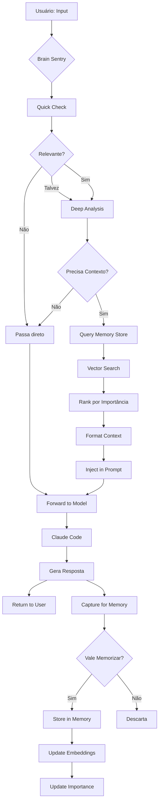
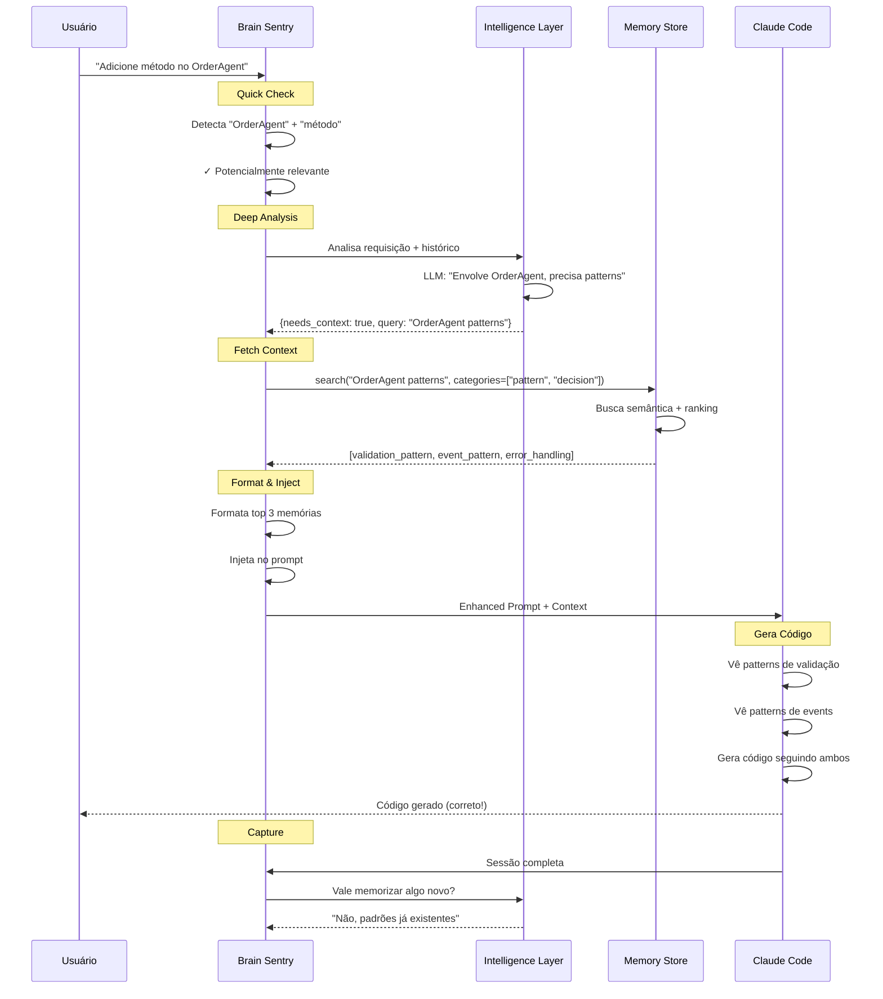
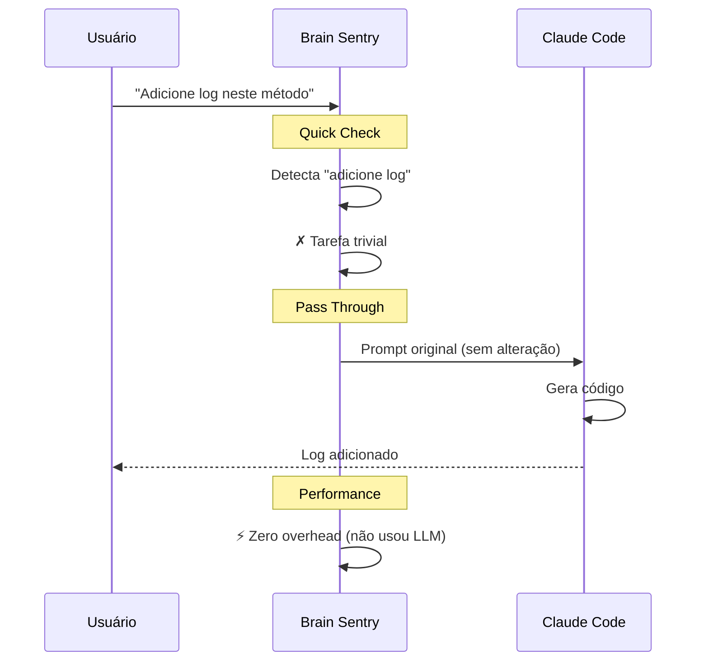
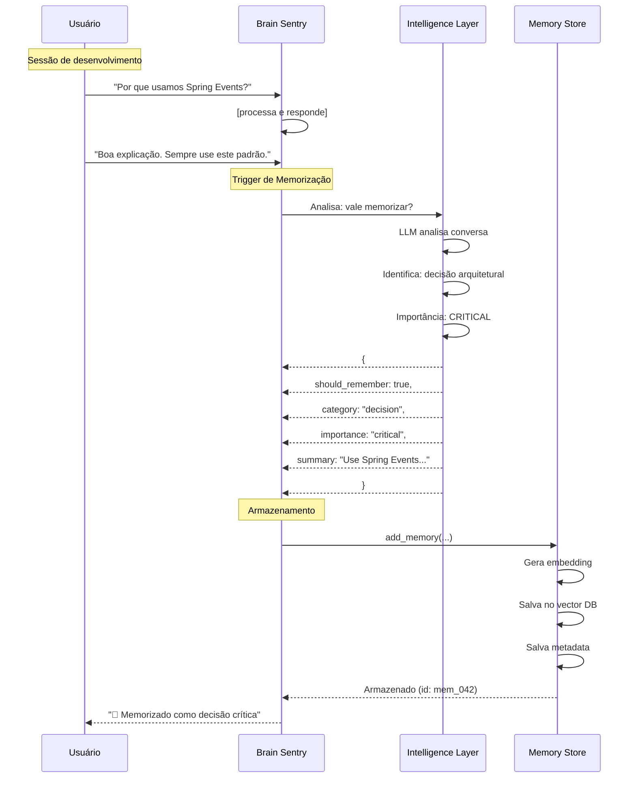
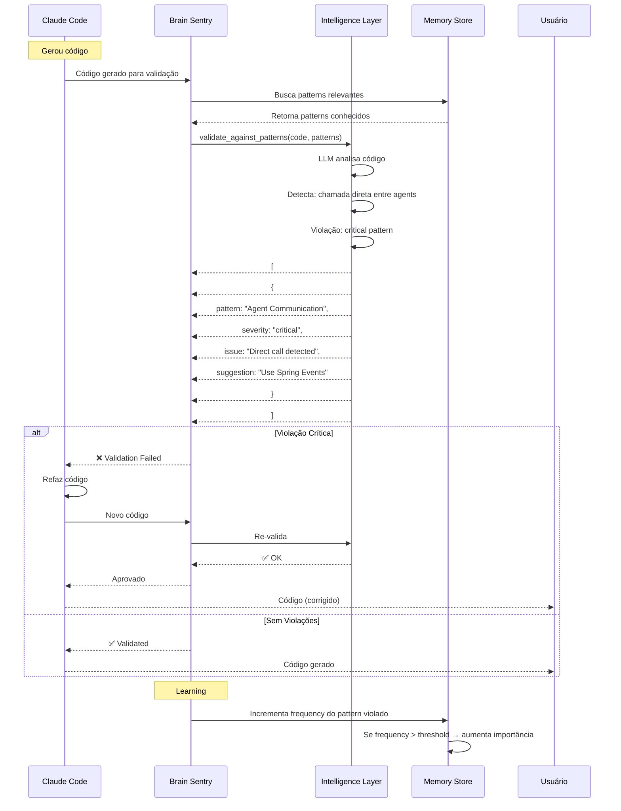
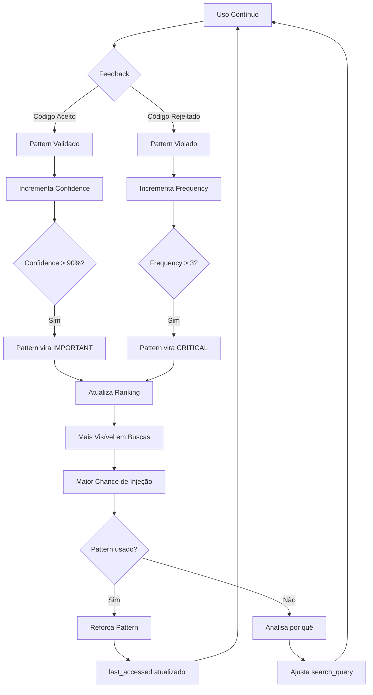
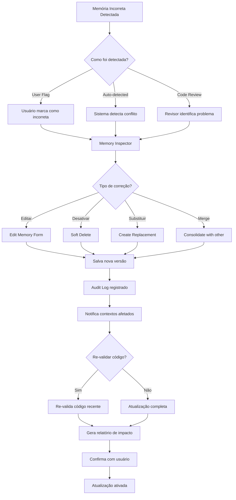
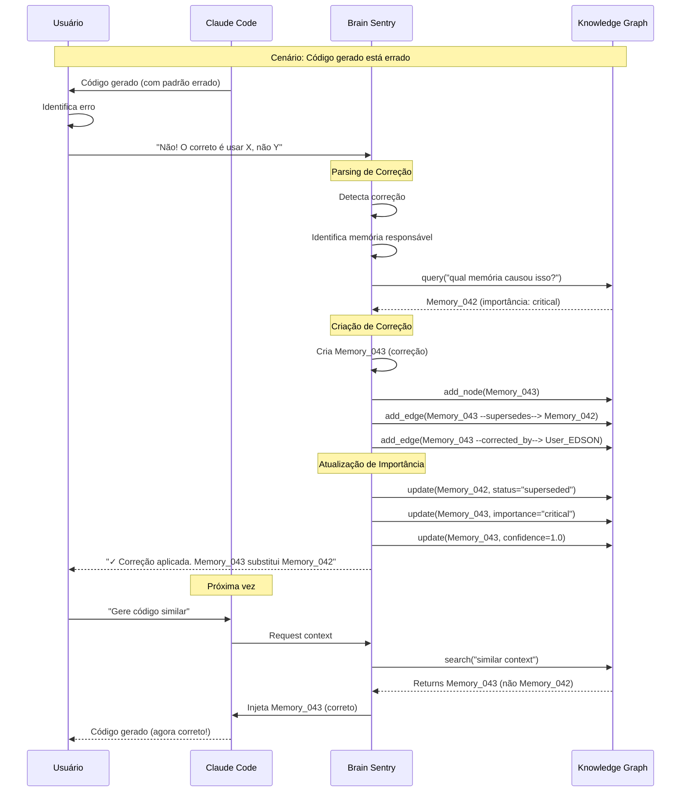

# Project Brain Sentry: Memória Seletiva Inteligente para Desenvolvimento com IA

**Documento Conceitual**  
**Versão:** 1.0  
**Data:** 16 de Janeiro de 2025  
**Autor:** EDSON (IntegrAllTech/VendaX.ai)  
**Contribuição:** Claude (Anthropic)

---

## Sumário Executivo

Este documento descreve o conceito do **Project Brain Sentry**, um sistema inteligente de gerenciamento de contexto para desenvolvimento de software com LLMs. A solução resolve o problema fundamental de **garantir que modelos de IA mantenham e apliquem conhecimento acumulado do projeto** sem depender da memória limitada do modelo ou de sua iniciativa para buscar informações.

### Conceito Central

Um **modelo LLM dedicado** (o "Sentry") que funciona como o **sistema límbico do cérebro humano**, interceptando todas as requisições, decidindo autonomamente quando contexto histórico é relevante, e injetando esse contexto automaticamente no prompt do modelo de trabalho.

**Diferencial-chave:** O modelo de trabalho (Claude Code, Cursor, etc.) **não precisa lembrar** de buscar contexto - o Sentry faz isso automaticamente, assim como nosso cérebro traz memórias relevantes sem esforço consciente.

---

## Índice

1. [Contexto e Motivação](#1-contexto-e-motivação)
2. [O Problema Fundamental](#2-o-problema-fundamental)
3. [Evolução da Discussão](#3-evolução-da-discussão)
4. [Analogia com o Cérebro Humano](#4-analogia-com-o-cérebro-humano)
5. [Arquitetura do Brain Sentry](#5-arquitetura-do-brain-sentry)
6. [Componentes do Sistema](#6-componentes-do-sistema)
7. [Fluxos de Funcionamento](#7-fluxos-de-funcionamento)
8. [Memória Seletiva Inteligente](#8-memória-seletiva-inteligente)
9. [Vantagens e Diferenciais](#9-vantagens-e-diferenciais)
10. [Considerações Técnicas](#10-considerações-técnicas)
11. [Roadmap de Implementação](#11-roadmap-de-implementação)
12. [Casos de Uso](#12-casos-de-uso)
13. [Potencial de Produto](#13-potencial-de-produto)

---

## 1. Contexto e Motivação

### 1.1 Cenário Atual

O desenvolvimento de software com assistentes de IA (Claude Code, Cursor, GitHub Copilot, etc.) enfrenta um desafio crítico: **perda de contexto e inconsistência ao longo do tempo**.

**Situação típica no VendaX.ai:**
- Segunda-feira: Decisão arquitetural - "Usar Spring Events para comunicação entre agentes"
- Terça-feira: Implementação seguindo o padrão
- Quinta-feira: Nova feature - IA esquece o padrão e sugere chamadas REST diretas
- Sexta-feira: Refactoring manual para corrigir

### 1.2 Tentativas de Solução Existentes

**Técnicas tradicionais tentadas:**
- `claude.md` e `README.md` com diretrizes
- Skills e documentação de padrões
- Comentários no código
- System prompts elaborados

**Problema recorrente:** O modelo simplesmente **ignora** ou **esquece** de consultar essas informações, mesmo quando elas existem e estão acessíveis.

### 1.3 O Insight Crucial

> "E se a decisão de usar contexto não fosse do modelo de trabalho, mas de outro modelo dedicado que cuida da memória?"

Esta pergunta mudou completamente a abordagem: **tirar a responsabilidade de "lembrar" do modelo que está trabalhando** e delegá-la a um **sentinela cognitivo** especializado.

---

## 2. O Problema Fundamental

### 2.1 Anatomia do Problema

```
┌─────────────────────────────────────────┐
│  Informação Existe                       │
│  • claude.md tem os padrões             │
│  • Skills documentam as práticas        │
│  • Código mostra exemplos               │
└──────────────┬──────────────────────────┘
               │
               ↓
┌─────────────────────────────────────────┐
│  Modelo Recebe Informação                │
│  • System prompt com 20k+ tokens        │
│  • Documentação misturada com código    │
│  • Múltiplas fontes competindo          │
└──────────────┬──────────────────────────┘
               │
               ↓
┌─────────────────────────────────────────┐
│  Information Overload                    │
│  • Diretrizes se perdem no "ruído"      │
│  • Prior training bias é mais forte     │
│  • Modelo não sabe o que priorizar      │
└──────────────┬──────────────────────────┘
               │
               ↓
┌─────────────────────────────────────────┐
│  Resultado: Inconsistência               │
│  • Padrões ignorados                     │
│  • Decisões arquiteturais esquecidas    │
│  • Erros repetidos                       │
└─────────────────────────────────────────┘
```

### 2.2 Por Que Técnicas Tradicionais Falham

**1. Competição por Atenção**
- System prompt: 5000 tokens (instruções gerais)
- claude.md: 2000 tokens (diretrizes do projeto)
- Skills: 3000 tokens (padrões específicos)
- Código atual: 10000 tokens (contexto imediato)
- **Total: 20000+ tokens competindo por atenção**

**2. Prior Training Bias**
- Modelo foi treinado em milhões de repositórios
- 80% usam padrões genéricos (ex: REST)
- Suas diretrizes específicas são apenas 0.01% do contexto
- **Viés do treinamento "vence" instruções específicas**

**3. Falta de Enforcement**
- Documentação é vista como "sugestão"
- Não há validação automática
- Modelo pode "escolher" ignorar

**4. Ausência de Priorização**
- Tudo tem o mesmo peso
- Não há sinalização de criticidade
- Modelo não sabe o que é fundamental vs. opcional

### 2.3 O Problema com MCP Tools

Mesmo com Model Context Protocol (MCP) fornecendo ferramentas de busca de contexto:

```
Problema: O modelo precisa LEMBRAR de chamar o tool

User: "Adicione método no OrderAgent"
↓
Claude Code tem access to:
  - get_critical_context() tool ✓
  - recall(query) tool ✓
  - validate_patterns() tool ✓
↓
MAS... o modelo simplesmente:
  - Não chama nenhum tool
  - Gera código direto
  - Ignora padrões estabelecidos
↓
Resultado: Mesmo problema
```

**A decisão de buscar contexto não pode depender do modelo que está executando a tarefa.**

---

## 3. Evolução da Discussão

### 3.1 Primeira Abordagem: RAG Tradicional

**Conceito inicial:** Sistema de busca sobre decisões e padrões passados.

```
User Query → Search Vector DB → Return Context → LLM Uses Context
```

**Problemas identificados:**
- ❌ Quando buscar? Sempre? (desperdício) Sob demanda? (esquece)
- ❌ Como garantir que modelo use os resultados?
- ❌ Como evitar poluir contexto com informação irrelevante?

### 3.2 Segunda Abordagem: MCP com Tools

**Conceito:** Fornecer tools via MCP para que modelo busque contexto quando precisar.

```python
# Pseudo-código conceitual
tools = [
    "remember(content, context)",
    "recall(query)", 
    "get_critical_context()",
    "validate_against_memory(code)"
]
```

**Avanço:** Modelo tem **acesso** ao contexto.

**Limitação crítica:** Modelo precisa **lembrar de usar** os tools.

### 3.3 Terceira Abordagem: MCP Proativo

**Conceito:** MCP injeta contexto automaticamente quando detecta operações de código.

```python
# Pseudo-código conceitual
if operation in ["write_file", "create_file"]:
    context = get_relevant_context_for(file_path)
    inject_in_response(context)
```

**Avanço:** Não depende do modelo lembrar.

**Limitações:**
- ⚠️ Pode injetar contexto desnecessariamente
- ⚠️ Overhead em todas as operações
- ⚠️ Lógica de "quando injetar" ainda é simplista

### 3.4 Quarta Abordagem: Brain Sentry (Solução Final)

**O Insight Transformador:**

> "E se um modelo dedicado decidisse o que é relevante e injetasse automaticamente?"

**Mudança de paradigma:**
- ❌ **Antes:** Modelo de trabalho decide quando buscar contexto
- ✅ **Depois:** Modelo dedicado (Sentry) sempre analisa e injeta quando relevante

**Analogia perfeita com cérebro humano:**
- Você não decide conscientemente "vou lembrar de X agora"
- Memórias surgem automaticamente quando relevantes
- Sistema límbico filtra o que é importante

---

## 4. Analogia com o Cérebro Humano

### 4.1 Arquitetura do Cérebro

```
┌─────────────────────────────────────────┐
│  CÓRTEX PRÉ-FRONTAL                      │
│  • Pensamento consciente                 │
│  • Execução de tarefas                   │
│  • Raciocínio lógico                     │
│  Equivalente: Claude Code (modelo)       │
└──────────────┬──────────────────────────┘
               │
               ↓ memórias relevantes surgem
┌─────────────────────────────────────────┐
│  SISTEMA LÍMBICO                         │
│  • Filtragem de memórias                 │
│  • Decidir o que é relevante             │
│  • Emoção e importância                  │
│  Equivalente: Brain Sentry               │
└──────────────┬──────────────────────────┘
               │
               ↓ busca e recupera
┌─────────────────────────────────────────┐
│  HIPOCAMPO                               │
│  • Armazenamento de memórias             │
│  • Consolidação de longo prazo           │
│  • Indexação e recuperação               │
│  Equivalente: Memory Store (Vector DB)   │
└─────────────────────────────────────────┘
```

### 4.2 Como Funciona no Cérebro Humano

**Cenário:** Você está programando e precisa adicionar um método em uma classe.

1. **Córtex Pré-Frontal (Pensamento Consciente)**
   - "Preciso adicionar método no OrderAgent"
   - Foco na tarefa imediata

2. **Sistema Límbico (Automático/Inconsciente)**
   - Detecta palavra "OrderAgent"
   - Ativa conexões neurais relacionadas
   - Filtra memórias relevantes
   - **Automaticamente** traz à consciência:
     - "Ah sim, OrderAgent usa validação com BeanValidator"
     - "Lembro que agents se comunicam via Spring Events"
     - "Tem aquele padrão de tratamento de erro"

3. **Hipocampo (Memória)**
   - Armazena as memórias de longo prazo
   - Organiza por contexto e emoção
   - Fornece quando solicitado pelo sistema límbico

**Ponto-chave:** Você não pensa "vou lembrar de verificar os padrões do OrderAgent". A lembrança **surge automaticamente**.

### 4.3 Tradução para Sistema de IA

```
CÉREBRO HUMANO              →    BRAIN SENTRY SYSTEM
─────────────────────────────────────────────────────
Córtex Pré-Frontal          →    Claude Code (modelo de trabalho)
  • Executa tarefas              • Gera código
  • Raciocínio lógico            • Resolve problemas
  • NÃO gerencia memória         • NÃO busca contexto

Sistema Límbico             →    Brain Sentry (modelo dedicado)
  • Filtra relevância            • Analisa requisições
  • Traz memórias                • Injeta contexto
  • Automático                   • Sempre ativo
  • Inconsciente                 • Transparente

Hipocampo                   →    Memory Store (ChromaDB)
  • Armazena memórias            • Vector database
  • Consolidação                 • Embeddings
  • Recuperação                  • Busca semântica
```

### 4.4 Características da Memória Humana Replicadas

**1. Memória Seletiva**
- Cérebro: Não guarda tudo, só o importante
- Sentry: LLM analisa e decide o que vale memorizar

**2. Recuperação Automática**
- Cérebro: Memórias surgem quando relevantes
- Sentry: Injeta contexto sem ser solicitado

**3. Associação Contextual**
- Cérebro: "OrderAgent" ativa rede de conceitos relacionados
- Sentry: Busca semântica traz memórias conectadas

**4. Priorização por Importância**
- Cérebro: Memórias emocionalmente importantes são mais fortes
- Sentry: Memórias "critical" têm prioridade

**5. Consolidação com o Tempo**
- Cérebro: Repetição fortalece memórias
- Sentry: Patterns violados frequentemente viram "critical"

**6. Esquecimento Seletivo**
- Cérebro: Informação irrelevante degrada
- Sentry: Memórias não acessadas perdem relevância

---

## 5. Arquitetura do Brain Sentry

### 5.1 Visão Geral do Sistema

```
┌────────────────────────────────────────────────────┐
│                    USUÁRIO                          │
│   "Adicione método de processamento no OrderAgent" │
└─────────────────────┬──────────────────────────────┘
                      │
                      ↓
    ┌─────────────────────────────────────────────────┐
    │         BRAIN SENTRY (Interceptor)              │
    │  ┌──────────────────────────────────────────┐  │
    │  │  Análise de Relevância                   │  │
    │  │  • Quick Check (regex, 70% dos casos)    │  │
    │  │  • Deep Analysis (LLM, quando necessário)│  │
    │  │  • Decisão: precisa contexto?            │  │
    │  └──────────────┬───────────────────────────┘  │
    │                 │                               │
    │                 ↓ [SE relevante]                │
    │  ┌──────────────────────────────────────────┐  │
    │  │  Memory Store Query                      │  │
    │  │  • Busca semântica (embeddings)          │  │
    │  │  • Filtro por categoria                  │  │
    │  │  • Ranking por importância + relevância  │  │
    │  └──────────────┬───────────────────────────┘  │
    │                 │                               │
    │                 ↓                                │
    │  ┌──────────────────────────────────────────┐  │
    │  │  Context Injection                       │  │
    │  │  • Formata contexto concisamente         │  │
    │  │  • Prioriza críticos                     │  │
    │  │  • Limita tokens (~500-1000)             │  │
    │  └──────────────┬───────────────────────────┘  │
    └─────────────────┼───────────────────────────────┘
                      │
                      ↓
    ┌─────────────────────────────────────────────────┐
    │          PROMPT ENRIQUECIDO                      │
    │                                                   │
    │  System Context:                                  │
    │  🚨 Pattern: Agents validam com BeanValidator    │
    │  ⚠️ Decision: Use Spring Events para comunicação │
    │                                                   │
    │  User Request:                                    │
    │  "Adicione método de processamento..."           │
    └─────────────────┬─────────────────────────────────┘
                      │
                      ↓
    ┌─────────────────────────────────────────────────┐
    │          CLAUDE CODE (Modelo de Trabalho)        │
    │  • Recebe prompt já enriquecido                  │
    │  • NÃO precisa lembrar de buscar contexto        │
    │  • Contexto já está presente                     │
    │  • Gera código seguindo patterns                 │
    └──────────────────────────────────────────────────┘
```

### 5.2 Fluxo de Dados Detalhado



### 5.3 Arquitetura de Componentes

```
┌─────────────────────────────────────────────────────────┐
│                  APPLICATION LAYER                       │
│                                                           │
│  ┌───────────────┐  ┌──────────────┐  ┌──────────────┐ │
│  │ Claude Code   │  │   Cursor     │  │   Continue   │ │
│  │   Proxy       │  │   Wrapper    │  │   Plugin     │ │
│  └───────┬───────┘  └──────┬───────┘  └──────┬───────┘ │
│          └──────────────────┴──────────────────┘         │
└──────────────────────────┬───────────────────────────────┘
                           │
┌──────────────────────────┴───────────────────────────────┐
│                  BRAIN SENTRY CORE                        │
│                                                           │
│  ┌─────────────────────────────────────────────────────┐ │
│  │  Interceptor & Analyzer                             │ │
│  │  • Request interception                             │ │
│  │  • Relevance analysis (quick + deep)                │ │
│  │  • Decision engine                                  │ │
│  └─────────────────────────────────────────────────────┘ │
│                                                           │
│  ┌─────────────────────────────────────────────────────┐ │
│  │  Intelligence Layer (Qwen2.5-7B)                    │ │
│  │  • Importance analysis                              │ │
│  │  • Pattern detection                                │ │
│  │  • Context selection                                │ │
│  └─────────────────────────────────────────────────────┘ │
│                                                           │
│  ┌─────────────────────────────────────────────────────┐ │
│  │  Context Manager                                    │ │
│  │  • Query optimization                               │ │
│  │  • Result ranking                                   │ │
│  │  • Format & injection                               │ │
│  └─────────────────────────────────────────────────────┘ │
└──────────────────────────┬───────────────────────────────┘
                           │
┌──────────────────────────┴───────────────────────────────┐
│                  MEMORY LAYER                             │
│                                                           │
│  ┌──────────────────┐  ┌───────────────┐  ┌───────────┐ │
│  │  Vector Store    │  │  Metadata DB  │  │  Cache    │ │
│  │  (ChromaDB)      │  │  (SQLite)     │  │  (Redis)  │ │
│  │  • Embeddings    │  │  • Categories │  │  • Hot    │ │
│  │  • Similarity    │  │  • Importance │  │    Data   │ │
│  │  • Semantic      │  │  • Relations  │  │           │ │
│  └──────────────────┘  └───────────────┘  └───────────┘ │
└───────────────────────────────────────────────────────────┘
```

---

## 6. Componentes do Sistema

### 6.1 Brain Sentry Core

**Responsabilidade:** Interceptar todas as requisições e decidir sobre injeção de contexto.

```python
# Pseudo-código conceitual

class BrainSentry:
    def intercept_request(user_input, history):
        # Fase 1: Quick Check (70% dos casos, sem LLM)
        quick_result = quick_relevance_check(user_input)
        
        if quick_result == IRRELEVANT:
            return pass_through(user_input)
        
        # Fase 2: Deep Analysis (LLM decide)
        analysis = llm_analyze(user_input, history)
        
        if not analysis.needs_context:
            return pass_through(user_input)
        
        # Fase 3: Fetch Context
        memories = memory_store.search(
            query=analysis.search_query,
            categories=analysis.categories,
            max_results=3
        )
        
        # Fase 4: Inject
        enhanced_prompt = format_with_context(user_input, memories)
        
        return enhanced_prompt
```

**Características:**
- ⚡ **Rápido:** Quick check filtra 70% sem custo
- 🎯 **Preciso:** Deep analysis quando necessário
- 🔄 **Sempre ativo:** Intercepta 100% das requisições
- 🧠 **Inteligente:** Aprende com feedback

### 6.2 Intelligence Layer (Qwen2.5-7B)

**Responsabilidade:** Decisões inteligentes sobre memória e contexto.

```python
# Pseudo-código conceitual

class MemoryIntelligence:
    def analyze_importance(content, context):
        """Decide se vale memorizar"""
        prompt = f"""
        Content: {content}
        Context: {context}
        
        Should I remember this? Why?
        Categories: decision|pattern|antipattern|domain
        Importance: critical|important|minor
        """
        
        decision = llm.generate(prompt)
        return decision
    
    def analyze_relevance(user_request, history):
        """Decide se precisa buscar contexto"""
        prompt = f"""
        User request: {user_request}
        Recent history: {history}
        
        Does this need project context? What to search?
        """
        
        analysis = llm.generate(prompt)
        return analysis
    
    def validate_against_patterns(code, patterns):
        """Valida código contra padrões conhecidos"""
        prompt = f"""
        Code: {code}
        Known patterns: {patterns}
        
        Any violations? Suggestions?
        """
        
        validation = llm.generate(prompt)
        return validation
```

**Características:**
- 🏠 **Local:** Roda na RTX 3060
- 🚀 **Rápido:** Qwen2.5-7B @ 41 tokens/sec
- 💰 **Zero custo:** Sem APIs externas
- 🔒 **Privado:** Dados não saem do servidor

### 6.3 Memory Store

**Responsabilidade:** Armazenar e recuperar memórias do projeto.

```python
# Pseudo-código conceitual

class MemoryStore:
    def __init__(self):
        self.vector_db = ChromaDB()
        self.metadata_db = SQLiteDB()
    
    def add_memory(content, category, importance):
        """Adiciona nova memória"""
        embedding = generate_embedding(content)
        
        memory_id = self.vector_db.add(
            embedding=embedding,
            content=content
        )
        
        self.metadata_db.store(
            id=memory_id,
            category=category,
            importance=importance,
            timestamp=now(),
            frequency=0
        )
    
    def search(query, categories, max_results):
        """Busca semântica"""
        query_embedding = generate_embedding(query)
        
        # Busca por similaridade
        results = self.vector_db.search(
            embedding=query_embedding,
            filters={"category": categories}
        )
        
        # Enriquece com metadata
        enriched = []
        for result in results:
            metadata = self.metadata_db.get(result.id)
            enriched.append({
                **result,
                **metadata,
                "score": calculate_score(result, metadata)
            })
        
        # Rank por score composto
        enriched.sort(key=lambda x: x['score'], reverse=True)
        
        return enriched[:max_results]
    
    def calculate_score(result, metadata):
        """Score composto: relevância + importância + recência"""
        relevance = result.similarity
        importance_weight = {
            'critical': 3.0,
            'important': 2.0,
            'minor': 1.0
        }[metadata.importance]
        
        recency = days_since(metadata.timestamp)
        recency_boost = 1.0 / (1.0 + recency / 30)  # Decay mensal
        
        return relevance * importance_weight * recency_boost
```

**Estrutura de Dados:**

```yaml
# Exemplo de memória armazenada

id: mem_001
category: pattern
importance: critical
summary: "Agents must validate input with BeanValidator before processing"
content: |
  All agent classes must validate their input DTOs using 
  BeanValidator before executing business logic.
code_example: |
  @Service
  public class OrderAgent {
      private final Validator validator;
      
      public void process(OrderRequest request) {
          Set<ConstraintViolation> violations = validator.validate(request);
          if (!violations.isEmpty()) {
              throw new ValidationException(violations);
          }
          // ... business logic
      }
  }
tags:
  - validation
  - agents
  - bean-validator
related_concepts:
  - agent_architecture
  - input_validation
  - spring_validation
frequency: 5  # Usado/citado 5 vezes
last_accessed: 2025-01-15T14:30:00Z
created: 2025-01-10T09:15:00Z
embedding: [0.234, -0.567, 0.123, ...]  # 768-dim vector
```

### 6.4 Context Manager

**Responsabilidade:** Gerenciar formatação e injeção de contexto.

```python
# Pseudo-código conceitual

class ContextManager:
    def format_for_injection(memories, max_tokens=1000):
        """Formata memórias para injeção otimizada"""
        
        formatted = "## 🧠 Project Brain Context\n\n"
        tokens_used = 0
        
        # Agrupa por categoria
        by_category = group_by(memories, 'category')
        
        # Prioridade: critical > important > info
        priority_order = ['critical', 'important', 'info']
        
        for importance in priority_order:
            items = [m for m in memories if m.importance == importance]
            
            if not items:
                continue
            
            icon = {'critical': '🚨', 'important': '⚠️', 'info': 'ℹ️'}[importance]
            formatted += f"### {icon} {importance.title()}\n\n"
            
            for item in items:
                # Estima tokens
                item_tokens = estimate_tokens(item)
                
                if tokens_used + item_tokens > max_tokens:
                    break
                
                formatted += format_memory_item(item)
                tokens_used += item_tokens
        
        return formatted
    
    def format_memory_item(memory):
        """Formata item individual"""
        output = f"**{memory.category.title()}:** {memory.summary}\n"
        
        if memory.code_example:
            # Trunca exemplo se muito longo
            example = truncate(memory.code_example, max_lines=10)
            output += f"```{memory.language}\n{example}\n```\n"
        
        output += "\n"
        return output
    
    def inject_into_prompt(original_prompt, context):
        """Injeta contexto no prompt"""
        
        # Estratégia: System context + User request
        enhanced = f"""<system_context>
{context}
</system_context>

<user_request>
{original_prompt}
</user_request>

Follow the patterns and decisions in the system context above."""

        return enhanced
```

---

## 7. Fluxos de Funcionamento

### 7.1 Fluxo: Nova Requisição (Com Contexto Necessário)



### 7.2 Fluxo: Nova Requisição (Sem Contexto Necessário)



### 7.3 Fluxo: Captura e Armazenamento de Nova Memória



### 7.4 Fluxo: Validação de Código Gerado



### 7.5 Fluxo: Evolução e Aprendizado



---

## 8. Memória Seletiva Inteligente

### 8.1 Critérios de Memorização

O Brain Sentry não memoriza tudo - apenas o que é verdadeiramente importante. A decisão é feita por um LLM dedicado.

**Perguntas que o LLM responde:**

1. **Isso é importante para o futuro?**
   - Decisão arquitetural? → SIM
   - Bug fix trivial? → NÃO

2. **Isso estabelece um padrão?**
   - Forma consistente de fazer X? → SIM
   - Solução one-off? → NÃO

3. **Isso previne erros futuros?**
   - Anti-pattern identificado? → SIM
   - Código auto-explicativo? → NÃO

4. **Isso adiciona contexto de negócio?**
   - Regra de domínio importante? → SIM
   - Detalhe de implementação? → NÃO

**Análise de Importância:**

```python
# Pseudo-código do processo de análise

def analyze_should_remember(content, context):
    prompt = f"""
    Analyze if this is worth remembering in project memory.
    
    Content: {content}
    Context: {context}
    
    Consider:
    - Is this a lasting pattern or one-time fix?
    - Will this be relevant in 1 month? 6 months?
    - Does this prevent future mistakes?
    - Is this already documented elsewhere?
    
    Respond with:
    {{
      "should_remember": true/false,
      "reasoning": "...",
      "importance": "critical|important|minor",
      "category": "decision|pattern|antipattern|domain|bug|optimization",
      "tags": ["tag1", "tag2"],
      "estimated_relevance_period": "1 week|1 month|6 months|indefinite"
    }}
    """
    
    return llm.analyze(prompt)
```

### 8.2 Categorização Automática

**Categorias Principais:**

| Categoria | Descrição | Exemplos | Importância Típica |
|-----------|-----------|----------|-------------------|
| `decision` | Decisões arquiteturais | "Usar Spring Events", "PostgreSQL para OLTP" | Critical |
| `pattern` | Padrões de código | "Validação com BeanValidator", "Builder para DTOs" | Important |
| `antipattern` | O que NÃO fazer | "Nunca usar Optional.get()", "Evitar N+1 queries" | Critical |
| `domain` | Conhecimento de negócio | "Pedido tem 5 status", "Comissão é 3% sobre líquido" | Important |
| `bug` | Bugs resolvidos importantes | "Bug de concorrência em X", "Memory leak em Y" | Minor → Important |
| `optimization` | Otimizações relevantes | "Cache de SKUs melhora 10x", "Batch de 100 é ideal" | Minor → Important |
| `integration` | Detalhes de integrações | "Consinco usa ISO-8859-1", "Winthor timeout 30s" | Important |

### 8.3 Sistema de Importância Dinâmica

Importância não é estática - evolui com o uso.

```
MINOR → IMPORTANT → CRITICAL
  ↑           ↑           ↑
  │           │           │
 Criação   Validado   Frequente
           3+ vezes   uso/violação
```

**Triggers de Promoção:**

```python
# Pseudo-código

def update_importance(memory):
    # Promove se usado frequentemente
    if memory.access_count > 10:
        promote_to("important")
    
    # Promove se violado repetidamente
    if memory.violation_count > 3:
        promote_to("critical")
    
    # Promove se validado em code review
    if memory.validated_by_human:
        promote_to("important")
    
    # Rebaixa se nunca usado em 3 meses
    if days_since(memory.last_accessed) > 90:
        demote_to("minor")
```

### 8.4 Detecção de Padrões Emergentes

O sistema identifica padrões que se repetem mesmo sem registro explícito.

```python
# Pseudo-código conceitual

def detect_emerging_patterns():
    # Analisa código gerado recentemente
    recent_code = get_code_from_last_n_days(30)
    
    # Busca por repetições
    patterns = llm.analyze(f"""
    Analyze this code and identify repeated patterns:
    {recent_code}
    
    Return patterns that appear 3+ times.
    """)
    
    for pattern in patterns:
        if not exists_in_memory(pattern):
            # Novo pattern emergente
            add_memory(
                content=pattern,
                category="pattern",
                importance="important",
                source="auto_detected"
            )
            
            notify_user(f"🧠 New pattern detected: {pattern.summary}")
```

### 8.5 Consolidação e Deduplicação

Memórias similares são consolidadas automaticamente.

```python
# Pseudo-código

def consolidate_memories():
    for memory in memory_store.all():
        # Busca similares (embedding distance < 0.05)
        similar = memory_store.find_similar(memory, threshold=0.95)
        
        if len(similar) > 1:
            # Consolida
            consolidated = merge_memories(similar)
            
            # Mantém IDs para rastreamento
            consolidated.merged_from = [m.id for m in similar]
            consolidated.frequency = sum(m.frequency for m in similar)
            
            # Salva consolidada
            memory_store.add(consolidated)
            
            # Marca antigas como merged
            for m in similar:
                m.status = "merged_into"
                m.merged_into = consolidated.id
```

---

## 9. Vantagens e Diferenciais

### 9.1 Comparação com Soluções Existentes

| Aspecto | Abordagens Tradicionais | Brain Sentry |
|---------|------------------------|--------------|
| **Quem decide contexto?** | Modelo de trabalho (esquece) | Modelo dedicado (sempre) |
| **Quando injeta?** | Sob demanda (se lembrar) | Automaticamente (quando relevante) |
| **Garantia de uso?** | ❌ Não | ✅ Sim |
| **Memória seletiva?** | ❌ Armazena tudo ou nada | ✅ LLM decide o que é importante |
| **Evolução?** | ❌ Estático | ✅ Aprende e adapta |
| **Validação?** | ❌ Pós-facto manual | ✅ Automática e proativa |
| **Overhead?** | Alto (sempre busca) ou Zero (nunca busca) | Otimizado (quick check filtra 70%) |

### 9.2 Vantagens Técnicas

✅ **Arquitetura Correta**
- Separação de responsabilidades clara
- Modelo de trabalho foca na tarefa
- Modelo de memória foca no contexto

✅ **Performance Otimizada**
- Quick check (regex) filtra 70% sem LLM
- Deep analysis apenas quando necessário
- Cache de análises frequentes

✅ **Escalabilidade**
- Local-first (RTX 3060 é suficiente)
- Pode escalar para cloud se necessário
- Vector DB otimizado para milhões de memórias

✅ **Manutenibilidade**
- Sistema se auto-mantém
- Memórias irrelevantes degradam naturalmente
- Padrões importantes são reforçados

✅ **Transparência**
- Usuário vê quando contexto é injetado
- Pode auditar decisões do Sentry
- Pode corrigir memórias incorretas

### 9.3 Benefícios para Equipes

**Onboarding de Desenvolvedores:**
```
Novo Dev: "Como faço X no projeto?"
Brain Sentry: [injeta automaticamente patterns de X]
Claude Code: [gera código seguindo patterns]
Resultado: Novo dev produtivo em dias, não semanas
```

**Consistência de Código:**
```
Todo código gerado por IA:
- Segue mesmos patterns
- Respeita mesmas decisões
- Evita anti-patterns conhecidos
Resultado: Codebase coerente
```

**Knowledge Retention:**
```
Dev Sênior sai da empresa:
Brain Sentry tem memórias de:
- Decisões que ele tomou
- Patterns que ele estabeleceu
- Problemas que ele resolveu
Resultado: Conhecimento não se perde
```

**Code Review Automatizado:**
```
Pull Request → Brain Sentry valida → Aponta violações
Resultado: Menos trabalho manual de review
```

### 9.4 Comparação: Antes vs Depois

**Cenário: Adicionar feature em componente existente**

**ANTES (sem Brain Sentry):**
```
1. Dev pergunta: "Como adiciono método no OrderAgent?"
2. Claude Code gera código genérico
3. Code review encontra problemas:
   - Faltou validação
   - Usou REST ao invés de Events
   - Não seguiu padrão de erro
4. Dev corrige manualmente
5. Segundo round de review
6. Finalmente merged
Tempo: 2-3 dias
```

**DEPOIS (com Brain Sentry):**
```
1. Dev pergunta: "Como adiciono método no OrderAgent?"
2. Brain Sentry:
   - Detecta "OrderAgent"
   - Injeta patterns de validação, events, erro
3. Claude Code gera código já correto
4. Code review: ✅ aprovado
5. Merged
Tempo: 2-3 horas
```

**Ganho: 10x mais rápido + maior qualidade**

---

## 10. Considerações Técnicas

### 10.1 Requisitos de Hardware

**Configuração Mínima (Local):**
- GPU: RTX 3060 (12GB VRAM) ou superior
- RAM: 16GB
- Storage: 50GB para modelos + 10GB para vector DB
- CPU: Qualquer moderno (Intel i5/Ryzen 5+)

**Configuração Recomendada:**
- GPU: RTX 4070/4080 (16GB+ VRAM)
- RAM: 32GB
- Storage: 100GB SSD NVMe
- CPU: Intel i7/Ryzen 7+

**Alternativa Cloud:**
- RunPod/Vast.ai: ~$0.30/hora
- AWS g4dn.xlarge: ~$0.50/hora
- Pode usar durante sprint, desligar fora do horário

### 10.2 Stack Tecnológica

**Brain Sentry Core:**
```
- Language: Python 3.11+
- Framework: FastAPI (API) ou asyncio (daemon)
- LLM: Qwen2.5-7B (llama-cpp-python)
- Embedding: sentence-transformers/all-MiniLM-L6-v2
```

**Memory Store:**
```
- Vector DB: ChromaDB (local) ou Qdrant (production)
- Metadata: SQLite (local) ou PostgreSQL (production)
- Cache: In-memory dict (local) ou Redis (production)
```

**Integration Layer:**
```
- MCP Protocol: MCP SDK (se via MCP)
- CLI Wrapper: subprocess + argparse (se via proxy)
- API: REST endpoints (se via HTTP)
```

### 10.3 Performance Esperada

**Latência:**
```
Quick Check (regex):        < 10ms
Deep Analysis (LLM):        200-500ms (batch de 10 tokens)
Memory Search:              50-100ms
Context Injection:          < 10ms
────────────────────────────────────
Total (com contexto):       300-700ms
Total (sem contexto):       < 20ms
```

**Throughput:**
```
Quick checks: 100+ requests/sec
Deep analysis: 10-20 requests/sec (limited by LLM)
Com GPU queue: pode processar batch de 5 em paralelo
```

**Uso de Recursos:**
```
VRAM: 6-8GB (Qwen2.5-7B + embeddings)
RAM: 4-6GB (vector DB cache)
CPU: < 20% (em idle)
GPU: 100% durante análise, 0% em quick check
```

### 10.4 Escalabilidade

**Projeto Individual (VendaX.ai):**
```
Memórias: ~500-1000
Throughput: 10 req/sec
Hardware: RTX 3060 (suficiente)
```

**Equipe Pequena (5-10 devs):**
```
Memórias: ~2000-5000
Throughput: 50 req/sec
Hardware: RTX 4070 ou cloud spot instances
```

**Empresa (50+ devs):**
```
Memórias: ~50000+
Throughput: 500+ req/sec
Hardware: Cluster GPU + load balancer
Arquitetura: Microservices
- Sentry Fleet (horizontal scale)
- Vector DB distribuído (Qdrant cluster)
- Redis cache layer
```

### 10.5 Segurança e Privacidade

**Local-First por Design:**
- Todos os dados ficam no servidor local
- Nenhuma chamada a APIs externas
- Zero telemetria por padrão

**Controle de Acesso:**
```python
# Pseudo-código

class AccessControl:
    def can_access_memory(user, memory):
        # Por projeto
        if memory.project != user.current_project:
            return False
        
        # Por sensibilidade
        if memory.sensitive and not user.has_permission("sensitive"):
            return False
        
        return True
```

**Sanitização:**
```python
# Pseudo-código

def sanitize_before_storage(content):
    # Remove dados sensíveis
    content = remove_credentials(content)
    content = remove_personal_data(content)
    content = remove_api_keys(content)
    
    return content
```

### 10.6 Monitoramento e Observabilidade

**Métricas Importantes:**
```
- Injection rate: % de requests que receberam contexto
- Hit rate: % de contexto injetado que foi útil
- Miss rate: % de vezes que faltou contexto relevante
- False positive rate: % de injeções desnecessárias
- Latency p50, p95, p99
- Memory growth rate
- Pattern usage frequency
```

**Logging:**
```python
# Pseudo-código

log_entry = {
    "timestamp": now(),
    "user_request": "...",
    "quick_check_result": "relevant",
    "deep_analysis_needed": True,
    "context_injected": True,
    "memories_used": ["mem_001", "mem_042"],
    "latency_ms": 345,
    "user_feedback": "accepted"  # capturado depois
}
```

**Dashboard:**
```
Brain Sentry Dashboard
──────────────────────────────────────
Requests Today:        1,247
Context Injections:      423 (34%)
Avg Latency:           287ms
Memory Store Size:     1,834 memories

Top Injected Patterns:
1. Agent Validation (89 times)
2. Spring Events (67 times)
3. Error Handling (45 times)

Learning This Week:
• 12 new patterns detected
• 3 patterns promoted to CRITICAL
• 8 memories consolidated
```

---

## 11. Auditabilidade, Observabilidade e Correção

### 11.1 Princípios de Governança

**Transparência Total:**
- Todas as decisões do Brain Sentry devem ser rastreáveis
- Cada memória deve ter proveniência clara
- Usuário deve poder auditar e corrigir

**Confiança com Verificação:**
- Sistema é inteligente, mas não infalível
- Humano sempre tem palavra final
- Feedback loop para melhorar continuamente

**Fail-Safe:**
- Erro no Brain Sentry não deve quebrar workflow
- Memórias incorretas devem ser isoláveis
- Sistema deve degradar gracefully

### 11.2 Sistema de Auditoria Completo

#### 11.2.1 Audit Log Estruturado

Cada ação do Brain Sentry gera um registro auditável:

```python
# Pseudo-código: Estrutura de Audit Log

class AuditLog:
    """Registro imutável de cada decisão do sistema"""
    
    id: UUID  # Identificador único
    timestamp: datetime
    event_type: str  # "memory_add", "context_inject", "validation", etc
    
    # Contexto da ação
    user_request: str
    session_id: str
    user_id: str
    
    # Decisão tomada
    decision: dict = {
        "action": "inject_context",
        "reasoning": "Detected OrderAgent, relevant patterns found",
        "confidence": 0.87
    }
    
    # Dados envolvidos
    input_data: dict
    output_data: dict
    
    # Rastreamento de memórias
    memories_accessed: List[UUID]  # Quais memórias foram consultadas
    memories_created: List[UUID]   # Quais memórias foram criadas
    memories_modified: List[UUID]  # Quais foram modificadas
    
    # Performance
    latency_ms: int
    llm_calls: int
    tokens_used: int
    
    # Resultado
    outcome: str  # "success", "failed", "rejected_by_user"
    user_feedback: Optional[dict]  # Feedback posterior do usuário

# Exemplo de log real
{
  "id": "audit_001",
  "timestamp": "2025-01-16T14:32:15Z",
  "event_type": "context_injection",
  "user_request": "Adicione método no OrderAgent",
  "session_id": "sess_42",
  "user_id": "edson",
  
  "decision": {
    "action": "inject_context",
    "reasoning": "User mentioned 'OrderAgent'. Found 3 critical patterns. High confidence these are relevant.",
    "confidence": 0.89,
    "quick_check_result": "relevant",
    "deep_analysis_needed": true
  },
  
  "input_data": {
    "user_prompt": "Adicione método no OrderAgent",
    "conversation_history": [...]
  },
  
  "output_data": {
    "enhanced_prompt": "...",
    "injected_context": "🚨 Pattern: Validation...",
    "context_token_count": 456
  },
  
  "memories_accessed": ["mem_001", "mem_042", "mem_067"],
  "memories_created": [],
  "memories_modified": [],
  
  "latency_ms": 342,
  "llm_calls": 1,
  "tokens_used": 789,
  
  "outcome": "success",
  "user_feedback": {
    "helpful": true,
    "timestamp": "2025-01-16T14:35:00Z",
    "comment": "Código gerado seguiu os patterns perfeitamente"
  }
}
```

#### 11.2.2 Proveniência de Memórias

Cada memória registra sua origem e evolução:

```python
# Pseudo-código: Proveniência de Memória

class MemoryProvenance:
    """Rastreamento completo da origem de uma memória"""
    
    # Identificação
    memory_id: UUID
    version: int  # Versionamento
    
    # Origem
    source_type: str  # "conversation", "code_commit", "manual", "auto_detected"
    source_reference: str  # Link para origem (commit hash, chat url, etc)
    created_by: str  # user_id ou "system"
    created_at: datetime
    
    # Decisão de memorização
    importance_decision: dict = {
        "analyzer": "qwen2.5-7b",
        "prompt_used": "...",
        "reasoning": "Architectural decision with high impact",
        "confidence": 0.92,
        "human_approved": false
    }
    
    # Evolução
    modification_history: List[dict] = [
        {
            "version": 2,
            "modified_at": "2025-01-20T10:00:00Z",
            "modified_by": "edson",
            "change_type": "importance_upgrade",
            "reason": "Violated 3 times, promoting to critical",
            "old_importance": "important",
            "new_importance": "critical"
        }
    ]
    
    # Validação
    validation_status: str  # "pending", "approved", "rejected", "flagged"
    validated_by: Optional[str]
    validation_notes: Optional[str]
    
    # Uso e efetividade
    usage_stats: dict = {
        "times_accessed": 15,
        "times_injected": 8,
        "times_helpful": 7,  # Baseado em feedback
        "times_not_helpful": 1,
        "last_accessed": "2025-01-16T14:32:15Z"
    }
    
    # Relacionamentos
    related_memories: List[UUID]
    superseded_by: Optional[UUID]  # Se foi substituída
    consolidated_from: List[UUID]  # Se veio de merge

# Exemplo
{
  "memory_id": "mem_001",
  "version": 3,
  
  "source_type": "conversation",
  "source_reference": "https://claude.ai/chat/abc123#message-42",
  "created_by": "edson",
  "created_at": "2025-01-10T09:15:00Z",
  
  "importance_decision": {
    "analyzer": "qwen2.5-7b",
    "reasoning": "Architectural decision: Spring Events for agent communication. Critical for system consistency.",
    "confidence": 0.92,
    "human_approved": true,
    "approval_timestamp": "2025-01-10T09:20:00Z"
  },
  
  "modification_history": [
    {
      "version": 2,
      "modified_at": "2025-01-12T14:00:00Z",
      "modified_by": "system",
      "change_type": "usage_increment",
      "reason": "Pattern successfully applied in InventoryAgent"
    },
    {
      "version": 3,
      "modified_at": "2025-01-15T16:30:00Z",
      "modified_by": "system",
      "change_type": "importance_upgrade",
      "reason": "Violated 3 times, auto-promoting to critical",
      "old_importance": "important",
      "new_importance": "critical"
    }
  ],
  
  "validation_status": "approved",
  "validated_by": "edson",
  "validation_notes": "Core pattern, must always be followed",
  
  "usage_stats": {
    "times_accessed": 23,
    "times_injected": 12,
    "times_helpful": 11,
    "times_not_helpful": 1,
    "helpfulness_rate": 0.92,
    "last_accessed": "2025-01-16T14:32:15Z"
  }
}
```

### 11.3 Dashboard de Observabilidade

#### 11.3.1 Dashboard Principal

```
╔════════════════════════════════════════════════════════════╗
║           BRAIN SENTRY - OBSERVABILITY DASHBOARD           ║
╠════════════════════════════════════════════════════════════╣
║                                                             ║
║  📊 REALTIME METRICS                                       ║
║  ┌─────────────────┬──────────────┬──────────────────────┐║
║  │ Requests Today  │   1,247      │  ▲ 23% vs yesterday ║║
║  │ Context Inject  │   423 (34%)  │  Normal range       ║║
║  │ Avg Latency     │   287ms      │  ✓ Within SLA       ║║
║  │ Error Rate      │   0.3%       │  ✓ Healthy          ║║
║  └─────────────────┴──────────────┴──────────────────────┘║
║                                                             ║
║  🧠 MEMORY STORE                                           ║
║  ┌─────────────────────────────────────────────────────┐  ║
║  │ Total Memories:     1,834                           │  ║
║  │ Critical:            47  (view | audit | validate)  │  ║
║  │ Important:          312  (view | audit | validate)  │  ║
║  │ Minor:            1,475  (view | audit | validate)  │  ║
║  │                                                      │  ║
║  │ ⚠️  Flagged:          3  (review required)          │  ║
║  │ 🕐 Pending Review:    7  (newly detected patterns)  │  ║
║  └─────────────────────────────────────────────────────┘  ║
║                                                             ║
║  📈 TOP INJECTED PATTERNS (Last 7 Days)                   ║
║  ┌─────────────────────────────────────────────────────┐  ║
║  │ 1. Agent Validation (BeanValidator)      89 times   │  ║
║  │    ├─ Helpful: 82 (92%)  Not helpful: 7             │  ║
║  │    └─ [View Memory] [See Usage] [Edit]              │  ║
║  │                                                      │  ║
║  │ 2. Spring Events Communication           67 times   │  ║
║  │    ├─ Helpful: 65 (97%)  Not helpful: 2             │  ║
║  │    └─ [View Memory] [See Usage] [Edit]              │  ║
║  │                                                      │  ║
║  │ 3. Error Handling Pattern                45 times   │  ║
║  │    ├─ Helpful: 40 (89%)  Not helpful: 5             │  ║
║  │    └─ [View Memory] [See Usage] [Edit]              │  ║
║  └─────────────────────────────────────────────────────┘  ║
║                                                             ║
║  🔍 RECENT ACTIVITY (Last 10 actions)                     ║
║  ┌─────────────────────────────────────────────────────┐  ║
║  │ 14:32 Context Injection → OrderAgent                │  ║
║  │       Injected: mem_001, mem_042 | Latency: 342ms   │  ║
║  │       [View Details] [Audit Log]                     │  ║
║  │                                                      │  ║
║  │ 14:28 New Memory Created → Auto-detected            │  ║
║  │       "DTO validation pattern"                       │  ║
║  │       [Review] [Approve] [Reject]                    │  ║
║  │                                                      │  ║
║  │ 14:15 Memory Promoted → Critical                    │  ║
║  │       mem_067 (violated 3 times)                     │  ║
║  │       [View History] [Rollback]                      │  ║
║  └─────────────────────────────────────────────────────┘  ║
║                                                             ║
║  ⚠️  ALERTS & ISSUES                                       ║
║  ┌─────────────────────────────────────────────────────┐  ║
║  │ • mem_123 flagged: conflicting with mem_089         │  ║
║  │   [Resolve Conflict]                                 │  ║
║  │                                                      │  ║
║  │ • Latency spike detected at 13:45 (892ms avg)       │  ║
║  │   [Investigate]                                      │  ║
║  │                                                      │  ║
║  │ • 3 memories not accessed in 90+ days               │  ║
║  │   [Review for Archival]                              │  ║
║  └─────────────────────────────────────────────────────┘  ║
╚════════════════════════════════════════════════════════════╝
```

#### 11.3.2 Memory Inspector (Detail View)

```
╔════════════════════════════════════════════════════════════╗
║               MEMORY INSPECTOR - mem_001                    ║
╠════════════════════════════════════════════════════════════╣
║                                                             ║
║  📋 BASIC INFO                                             ║
║  ┌─────────────────────────────────────────────────────┐  ║
║  │ ID:           mem_001                                │  ║
║  │ Category:     pattern                                │  ║
║  │ Importance:   🚨 CRITICAL                            │  ║
║  │ Status:       ✓ Approved                             │  ║
║  │ Created:      2025-01-10 09:15                       │  ║
║  │ By:           edson                                  │  ║
║  │ Version:      3                                      │  ║
║  └─────────────────────────────────────────────────────┘  ║
║                                                             ║
║  📝 CONTENT                                                ║
║  ┌─────────────────────────────────────────────────────┐  ║
║  │ Summary:                                             │  ║
║  │ "Agents must validate input with BeanValidator      │  ║
║  │  before processing business logic"                   │  ║
║  │                                                      │  ║
║  │ Full Content:                                        │  ║
║  │ [Expand to view full content...]                     │  ║
║  │                                                      │  ║
║  │ Code Example:                                        │  ║
║  │ ```java                                              │  ║
║  │ public void process(OrderRequest req) {              │  ║
║  │   Set<ConstraintViolation> violations =              │  ║
║  │     validator.validate(req);                         │  ║
║  │   if (!violations.isEmpty()) throw ...               │  ║
║  │ }                                                    │  ║
║  │ ```                                                  │  ║
║  │                                                      │  ║
║  │ Tags: validation, agents, bean-validator            │  ║
║  └─────────────────────────────────────────────────────┘  ║
║                                                             ║
║  🔍 PROVENANCE                                             ║
║  ┌─────────────────────────────────────────────────────┐  ║
║  │ Source:  Conversation                                │  ║
║  │ Origin:  https://claude.ai/chat/abc123#msg-42       │  ║
║  │                                                      │  ║
║  │ AI Decision:                                         │  ║
║  │  "Architectural pattern with high impact.           │  ║
║  │   Prevents validation bugs. Should be critical."     │  ║
║  │  Confidence: 92%                                     │  ║
║  │                                                      │  ║
║  │ Human Review:                                        │  ║
║  │  ✓ Approved by edson on 2025-01-10                  │  ║
║  │  Note: "Core pattern, always enforce"               │  ║
║  └─────────────────────────────────────────────────────┘  ║
║                                                             ║
║  📊 USAGE STATISTICS                                       ║
║  ┌─────────────────────────────────────────────────────┐  ║
║  │ Times Accessed:    23                                │  ║
║  │ Times Injected:    12                                │  ║
║  │ Times Helpful:     11  (92% helpfulness)             │  ║
║  │ Times Violated:     3  (triggered promotion)         │  ║
║  │ Last Used:         2 hours ago                       │  ║
║  │                                                      │  ║
║  │ Injection Trend (7 days):                            │  ║
║  │ █▆▇█▅▆█                                              │  ║
║  │                                                      │  ║
║  │ [View Detailed Usage History]                        │  ║
║  └─────────────────────────────────────────────────────┘  ║
║                                                             ║
║  📜 VERSION HISTORY                                        ║
║  ┌─────────────────────────────────────────────────────┐  ║
║  │ v3 - 2025-01-15 16:30 - System                      │  ║
║  │ ├─ Promoted to CRITICAL (violated 3 times)          │  ║
║  │ └─ [View Diff] [Rollback to v2]                     │  ║
║  │                                                      │  ║
║  │ v2 - 2025-01-12 14:00 - System                      │  ║
║  │ ├─ Usage increment (applied in InventoryAgent)      │  ║
║  │ └─ [View Diff] [Rollback to v1]                     │  ║
║  │                                                      │  ║
║  │ v1 - 2025-01-10 09:15 - edson                       │  ║
║  │ └─ Initial creation                                  │  ║
║  └─────────────────────────────────────────────────────┘  ║
║                                                             ║
║  🔗 RELATIONSHIPS                                          ║
║  ┌─────────────────────────────────────────────────────┐  ║
║  │ Related Memories:                                    │  ║
║  │ • mem_042 - Spring Events pattern                   │  ║
║  │ • mem_067 - Error handling                          │  ║
║  │ • mem_089 - Agent architecture                      │  ║
║  │                                                      │  ║
║  │ Used Together With:                                  │  ║
║  │ • mem_042 (15 times)                                 │  ║
║  │ • mem_067 (8 times)                                  │  ║
║  └─────────────────────────────────────────────────────┘  ║
║                                                             ║
║  [Edit Memory] [Delete] [Flag Issue] [Export] [Share]     ║
╚════════════════════════════════════════════════════════════╝
```

### 11.4 Sistema de Correção

#### 11.4.1 Fluxo de Correção de Memória Incorreta



#### 11.4.2 Interface de Correção

```python
# Pseudo-código: Sistema de Correção

class MemoryCorrection:
    """Sistema para corrigir memórias incorretas"""
    
    def flag_incorrect(memory_id: UUID, reason: str, flagged_by: str):
        """Marca memória como incorreta"""
        memory = memory_store.get(memory_id)
        
        # Soft flag - não remove imediatamente
        memory.validation_status = "flagged"
        memory.flag_reason = reason
        memory.flagged_by = flagged_by
        memory.flagged_at = now()
        
        # Reduz importância temporariamente
        memory.temporary_importance_penalty = True
        
        # Notifica admin
        notify_admin(f"Memory {memory_id} flagged: {reason}")
        
        # Registra audit
        audit_log.add({
            "event": "memory_flagged",
            "memory_id": memory_id,
            "reason": reason,
            "flagged_by": flagged_by
        })
        
        return {
            "status": "flagged",
            "next_steps": [
                "Review in dashboard",
                "Edit or delete",
                "Impact analysis available"
            ]
        }
    
    def edit_memory(memory_id: UUID, changes: dict, edited_by: str):
        """Edita memória preservando histórico"""
        memory = memory_store.get(memory_id)
        
        # Cria nova versão
        old_version = memory.version
        new_version = old_version + 1
        
        # Preserva versão antiga
        memory_store.archive_version(memory_id, old_version)
        
        # Aplica mudanças
        for field, new_value in changes.items():
            old_value = getattr(memory, field)
            setattr(memory, field, new_value)
            
            # Registra mudança
            memory.modification_history.append({
                "version": new_version,
                "field": field,
                "old_value": old_value,
                "new_value": new_value,
                "modified_by": edited_by,
                "modified_at": now(),
                "reason": changes.get("edit_reason", "Manual correction")
            })
        
        memory.version = new_version
        memory.validation_status = "pending_revalidation"
        
        # Gera novo embedding se conteúdo mudou
        if "summary" in changes or "content" in changes:
            memory.embedding = generate_embedding(memory.content)
        
        memory_store.update(memory)
        
        # Audit
        audit_log.add({
            "event": "memory_edited",
            "memory_id": memory_id,
            "old_version": old_version,
            "new_version": new_version,
            "edited_by": edited_by,
            "changes": changes
        })
        
        return {
            "status": "updated",
            "new_version": new_version,
            "impact_analysis": analyze_impact(memory_id)
        }
    
    def rollback_memory(memory_id: UUID, target_version: int, by: str):
        """Reverte memória para versão anterior"""
        memory = memory_store.get(memory_id)
        archived = memory_store.get_archived_version(memory_id, target_version)
        
        if not archived:
            raise ValueError(f"Version {target_version} not found")
        
        # Restaura versão antiga como nova versão
        current_version = memory.version
        new_version = current_version + 1
        
        # Copia dados da versão antiga
        memory.restore_from(archived)
        memory.version = new_version
        memory.modification_history.append({
            "version": new_version,
            "modified_by": by,
            "modified_at": now(),
            "action": "rollback",
            "rolled_back_from": current_version,
            "rolled_back_to": target_version,
            "reason": f"Rollback to v{target_version}"
        })
        
        memory_store.update(memory)
        
        # Audit
        audit_log.add({
            "event": "memory_rollback",
            "memory_id": memory_id,
            "from_version": current_version,
            "to_version": target_version,
            "by": by
        })
        
        return {"status": "rolled_back", "current_version": new_version}
    
    def soft_delete(memory_id: UUID, reason: str, by: str):
        """Desativa memória sem deletar permanentemente"""
        memory = memory_store.get(memory_id)
        
        memory.status = "deleted"
        memory.deleted_at = now()
        memory.deleted_by = by
        memory.deletion_reason = reason
        
        # Não remove do banco - apenas marca
        memory_store.update(memory)
        
        # Audit
        audit_log.add({
            "event": "memory_deleted",
            "memory_id": memory_id,
            "deleted_by": by,
            "reason": reason,
            "recoverable": True
        })
        
        return {
            "status": "deleted",
            "recoverable": True,
            "recovery_command": f"brain-sentry restore {memory_id}"
        }
    
    def analyze_impact(memory_id: UUID):
        """Analisa impacto de mudar/deletar memória"""
        memory = memory_store.get(memory_id)
        
        # Busca uso recente
        recent_usage = audit_log.search({
            "memories_accessed": memory_id,
            "since": now() - timedelta(days=30)
        })
        
        # Busca código gerado com esta memória
        affected_sessions = [u.session_id for u in recent_usage]
        
        # Identifica memórias relacionadas
        related = memory_store.find_related(memory_id)
        
        return {
            "times_used_last_30_days": len(recent_usage),
            "affected_sessions": affected_sessions,
            "related_memories": related,
            "recommendation": generate_recommendation(memory, recent_usage)
        }
```

#### 11.4.3 CLI para Correção Rápida

```bash
# Comandos de correção via CLI

# Listar memórias flagged
$ brain-sentry review flagged
Found 3 flagged memories:
1. mem_123 - "Optional.get() pattern" (conflicting)
2. mem_145 - "REST endpoint pattern" (outdated)
3. mem_167 - "Cache strategy" (incorrect)

# Inspecionar memória específica
$ brain-sentry inspect mem_123
Memory: mem_123
Status: FLAGGED
Reason: Conflicts with mem_089
Flagged by: system (auto-detected)
Times used: 5
Last used: 2 days ago

[View full details]
[Edit] [Delete] [Resolve Conflict] [Unflag]

# Editar memória
$ brain-sentry edit mem_123 --summary "Nova descrição" --importance "minor"
Memory updated:
- summary: "Optional.get() pattern" → "Nova descrição"  
- importance: "important" → "minor"
Version: 3 → 4

Impact analysis:
- Used in 5 sessions last month
- Related to 2 other memories
- Recommend: Review recent code

# Rollback para versão anterior
$ brain-sentry rollback mem_123 --to-version 2
Rolling back mem_123 from v4 to v2...
✓ Rollback successful
Current version: 5 (restored from v2)

# Soft delete
$ brain-sentry delete mem_123 --reason "Outdated pattern"
Memory mem_123 soft-deleted
Recoverable: yes
To restore: brain-sentry restore mem_123

# Análise de impacto antes de deletar
$ brain-sentry impact mem_123
Impact Analysis for mem_123:

Usage (last 30 days): 12 times
Affected sessions: 8
Related memories: 3 (mem_042, mem_089, mem_156)

Recommendation: HIGH IMPACT
This memory is actively used. Consider:
1. Edit instead of delete
2. Create replacement first
3. Notify team before removing

# Resolver conflito entre memórias
$ brain-sentry resolve-conflict mem_123 mem_089
Conflicting memories detected:
- mem_123: "Use Optional.get() with check"
- mem_089: "Never use Optional.get()"

Resolution options:
1. Keep mem_089, delete mem_123
2. Keep mem_123, delete mem_089  
3. Merge into new memory
4. Mark both as conflicting (manual resolution)

Choose: 1

✓ Conflict resolved
mem_123 deleted, mem_089 kept
Audit log: audit_042

# Export audit trail
$ brain-sentry export-audit --since "2025-01-01" --format json > audit.json
Exported 1,247 audit entries to audit.json
```

### 11.5 Validação e Testes

#### 11.5.1 Testes de Qualidade de Memória

```python
# Pseudo-código: Sistema de Testes

class MemoryQualityTests:
    """Testes automáticos de qualidade das memórias"""
    
    def test_memory_consistency():
        """Detecta memórias conflitantes"""
        memories = memory_store.get_all_critical()
        
        conflicts = []
        for i, mem1 in enumerate(memories):
            for mem2 in memories[i+1:]:
                # Checa conflito semântico via LLM
                if llm_detect_conflict(mem1, mem2):
                    conflicts.append((mem1.id, mem2.id))
        
        return {
            "conflicts_found": len(conflicts),
            "details": conflicts,
            "action_required": len(conflicts) > 0
        }
    
    def test_memory_relevance():
        """Identifica memórias obsoletas"""
        threshold_days = 90
        obsolete = []
        
        for memory in memory_store.get_all():
            days_since_use = (now() - memory.last_accessed).days
            
            if days_since_use > threshold_days:
                obsolete.append({
                    "memory_id": memory.id,
                    "days_unused": days_since_use,
                    "recommendation": "archive_or_delete"
                })
        
        return {
            "obsolete_count": len(obsolete),
            "details": obsolete
        }
    
    def test_injection_effectiveness():
        """Mede efetividade das injeções"""
        recent_injections = audit_log.get_injections(days=7)
        
        helpful = sum(1 for inj in recent_injections if inj.user_feedback == "helpful")
        total = len(recent_injections)
        
        effectiveness = helpful / total if total > 0 else 0
        
        return {
            "effectiveness_rate": effectiveness,
            "total_injections": total,
            "helpful": helpful,
            "not_helpful": total - helpful,
            "target": 0.85,  # Meta: 85%
            "status": "healthy" if effectiveness > 0.85 else "needs_attention"
        }
    
    def run_all_tests():
        """Executa todos os testes"""
        results = {
            "timestamp": now(),
            "consistency": test_memory_consistency(),
            "relevance": test_memory_relevance(),
            "effectiveness": test_injection_effectiveness()
        }
        
        # Gera relatório
        report = generate_test_report(results)
        
        # Notifica se issues críticos
        if has_critical_issues(results):
            notify_admin(report)
        
        return results

# Executado automaticamente
schedule.every().day.at("03:00").do(run_all_tests)
```

#### 11.5.2 A/B Testing de Memórias

```python
# Pseudo-código: A/B Testing

class MemoryABTest:
    """Testa qual memória é mais efetiva"""
    
    def create_ab_test(memory_a_id: UUID, memory_b_id: UUID, test_name: str):
        """Cria teste A/B entre duas memórias"""
        
        test = {
            "test_id": generate_id(),
            "name": test_name,
            "memory_a": memory_a_id,
            "memory_b": memory_b_id,
            "started_at": now(),
            "split_ratio": 0.5,  # 50/50
            "status": "running"
        }
        
        # Próximas injeções alternam entre A e B
        ab_tests_store.add(test)
        
        return test
    
    def evaluate_test(test_id: UUID):
        """Avalia resultados do teste"""
        test = ab_tests_store.get(test_id)
        
        # Coleta métricas de ambas memórias
        results_a = get_metrics(test.memory_a, since=test.started_at)
        results_b = get_metrics(test.memory_b, since=test.started_at)
        
        # Compara efetividade
        winner = determine_winner(results_a, results_b)
        
        return {
            "test_id": test_id,
            "memory_a_metrics": results_a,
            "memory_b_metrics": results_b,
            "winner": winner,
            "confidence": calculate_confidence(results_a, results_b),
            "recommendation": f"Keep {winner}, archive the other"
        }

# Exemplo de uso
test = create_ab_test(
    memory_a_id="mem_old_pattern",
    memory_b_id="mem_new_pattern",
    test_name="Validation Pattern Evolution"
)

# Após 1 semana
results = evaluate_test(test.test_id)
# Results mostram mem_new_pattern é 15% mais efetivo
# Sistema recomenda: promover new, deprecar old
```

### 11.6 Alertas e Notificações

```python
# Pseudo-código: Sistema de Alertas

class AlertingSystem:
    """Sistema de alertas para anomalias"""
    
    alerts = {
        "conflict_detected": {
            "severity": "high",
            "action": "Resolve conflicting memories",
            "threshold": 1  # Alerta imediatamente
        },
        
        "high_error_rate": {
            "severity": "critical",
            "action": "Investigate system errors",
            "threshold": 0.05  # 5% error rate
        },
        
        "low_effectiveness": {
            "severity": "medium",
            "action": "Review memory quality",
            "threshold": 0.70  # < 70% helpful
        },
        
        "latency_spike": {
            "severity": "medium",
            "action": "Check performance",
            "threshold": 1000  # > 1s latency
        },
        
        "memory_growth": {
            "severity": "low",
            "action": "Review storage capacity",
            "threshold": 10000  # > 10k memories
        }
    }
    
    def check_alerts():
        """Verifica condições de alerta"""
        triggered = []
        
        # Conflitos
        conflicts = test_memory_consistency()
        if conflicts.conflicts_found >= alerts["conflict_detected"].threshold:
            triggered.append(create_alert("conflict_detected", conflicts))
        
        # Error rate
        error_rate = calculate_error_rate(hours=1)
        if error_rate >= alerts["high_error_rate"].threshold:
            triggered.append(create_alert("high_error_rate", error_rate))
        
        # Effectiveness
        effectiveness = test_injection_effectiveness()
        if effectiveness.rate < alerts["low_effectiveness"].threshold:
            triggered.append(create_alert("low_effectiveness", effectiveness))
        
        # Latency
        avg_latency = get_average_latency(hours=1)
        if avg_latency > alerts["latency_spike"].threshold:
            triggered.append(create_alert("latency_spike", avg_latency))
        
        # Process alerts
        for alert in triggered:
            process_alert(alert)
        
        return triggered
    
    def process_alert(alert):
        """Processa alerta"""
        # Log
        alert_log.add(alert)
        
        # Notifica
        if alert.severity == "critical":
            send_slack(alert)
            send_email(alert)
        elif alert.severity == "high":
            send_slack(alert)
        
        # Auto-remediation se possível
        if alert.type == "latency_spike":
            auto_scale_resources()
        
        # Dashboard
        dashboard.add_alert(alert)

# Executa a cada 5 minutos
schedule.every(5).minutes.do(check_alerts)
```

### 11.7 Relatórios e Analytics

```python
# Pseudo-código: Sistema de Relatórios

class ReportingSystem:
    """Gera relatórios de uso e qualidade"""
    
    def generate_weekly_report():
        """Relatório semanal de saúde do sistema"""
        
        report = {
            "period": "last_7_days",
            "generated_at": now(),
            
            "summary": {
                "total_requests": get_metric("requests", days=7),
                "context_injections": get_metric("injections", days=7),
                "injection_rate": calculate_rate("injections", days=7),
                "avg_latency": get_metric("latency_avg", days=7),
                "error_rate": get_metric("error_rate", days=7)
            },
            
            "memory_health": {
                "total_memories": memory_store.count(),
                "new_this_week": memory_store.count_new(days=7),
                "updated_this_week": memory_store.count_updated(days=7),
                "flagged": memory_store.count_flagged(),
                "effectiveness_rate": calculate_effectiveness(days=7)
            },
            
            "top_patterns": get_top_patterns(days=7, limit=10),
            
            "issues": {
                "conflicts": memory_store.count_conflicts(),
                "obsolete": memory_store.count_obsolete(),
                "needs_review": memory_store.count_pending_review()
            },
            
            "recommendations": generate_recommendations()
        }
        
        # Formata e envia
        formatted = format_report(report)
        send_email(to="edson@integraltech.com.br", subject="Brain Sentry Weekly Report", body=formatted)
        save_report(report)
        
        return report
    
    def generate_memory_quality_report(memory_id: UUID):
        """Relatório detalhado de uma memória específica"""
        memory = memory_store.get(memory_id)
        
        report = {
            "memory": memory,
            "usage_stats": get_usage_stats(memory_id, days=30),
            "effectiveness": calculate_effectiveness_single(memory_id),
            "related_memories": find_related(memory_id),
            "version_history": get_version_history(memory_id),
            "impact_analysis": analyze_impact(memory_id),
            "recommendations": generate_memory_recommendations(memory)
        }
        
        return report

# Agendamento
schedule.every().monday.at("08:00").do(generate_weekly_report)
```

---

## 12. Roadmap de Implementação

### 11.1 MVP - Fase 1 (1 semana)

**Objetivo:** Proof of Concept funcional

**Componentes:**
```
✓ Brain Sentry Core
  - Quick Check (regex-based)
  - Proxy CLI para Claude Code
  - Context injection básico

✓ Memory Store
  - ChromaDB local
  - CRUD básico
  - Busca por similaridade

✓ CLI Tools
  - brain-sentry add "content"
  - brain-sentry search "query"
  - brain-sentry list
```

**Não inclui:**
- Deep Analysis com LLM (usa heurísticas simples)
- Validação automática
- Learning loop

**Entrega:**
- Sistema que injeta contexto relevante 60% das vezes
- Manual para adicionar memórias
- Funciona com Claude Code

### 11.2 V1.0 - Fase 2 (2 semanas)

**Objetivo:** Sistema completo e inteligente

**Adições:**
```
✓ Intelligence Layer
  - Integração Qwen2.5-7B
  - Deep analysis
  - Importance scoring

✓ Memória Seletiva
  - Auto-capture de sessões
  - Decisão automática de memorização
  - Categorização inteligente

✓ Validação
  - Validação de código gerado
  - Detecção de anti-patterns
  - Feedback loop
```

**Entrega:**
- Sistema autônomo
- Não precisa manutenção manual
- Injeta contexto relevante 85%+ das vezes

### 11.3 V1.5 - Fase 3 (2 semanas)

**Objetivo:** Produção-ready com features avançadas

**Adições:**
```
✓ Learning System
  - Promoção automática de importância
  - Consolidação de memórias
  - Detecção de patterns emergentes

✓ Observability
  - Dashboard web
  - Métricas em tempo real
  - Logs estruturados

✓ Integration
  - Suporte para Cursor
  - Suporte para Continue.dev
  - API REST para integrações custom
```

**Entrega:**
- Sistema production-grade
- Monitoramento completo
- Suporte múltiplas IDEs

### 11.4 V2.0 - Fase 4 (4 semanas)

**Objetivo:** Produto comercial

**Adições:**
```
✓ Multi-tenancy
  - Suporte para múltiplos projetos
  - Isolamento de memórias
  - Controle de acesso

✓ Team Features
  - Memórias compartilhadas
  - Aprovação de patterns (review)
  - Sincronização entre devs

✓ Cloud Option
  - Deploy em cloud
  - Escalabilidade horizontal
  - Backup e disaster recovery

✓ Enterprise
  - SSO/SAML
  - Audit logs
  - Compliance (SOC2, GDPR)
```

**Entrega:**
- Produto SaaS completo
- Pronto para venda
- Documentação completa

### 11.5 Cronograma Visual

```
┌─────────────────────────────────────────────────────────┐
│ TIMELINE - Brain Sentry Development                     │
├─────────────────────────────────────────────────────────┤
│                                                           │
│ Week 1-2:   [████████] MVP - Proof of Concept           │
│              • Core + Memory + CLI                       │
│                                                           │
│ Week 3-4:   [████████████] V1.0 - Intelligence           │
│              • LLM Integration                           │
│              • Auto-learning                             │
│                                                           │
│ Week 5-6:   [████████████████] V1.5 - Production        │
│              • Dashboard                                 │
│              • Multi-IDE                                 │
│                                                           │
│ Week 7-10:  [████████████████████████] V2.0 - Product   │
│              • Multi-tenancy                             │
│              • Cloud Deploy                              │
│              • Enterprise Features                       │
│                                                           │
└─────────────────────────────────────────────────────────┘
```

---

## 12. Casos de Uso

### 12.1 Caso 1: Novo Dev Onboarding

**Situação:** João é novo no time do VendaX.ai

**Sem Brain Sentry:**
```
Dia 1-3: Lê documentação
Dia 4-5: Tenta fazer primeira task
Dia 6: Code review aponta 15 problemas
Dia 7-8: Corrige e aprende patterns
Semana 2: Ainda cometendo erros
Tempo até produtividade: 3-4 semanas
```

**Com Brain Sentry:**
```
Dia 1: Setup ambiente + Brain Sentry ativo
Dia 2: Primeira task com Claude Code
  → Brain Sentry injeta patterns automaticamente
  → Código gerado já segue padrões do projeto
Dia 3: Code review: apenas feedback minor
Dia 4-5: Trabalhando com confiança
Tempo até produtividade: 1 semana
```

**Ganho:** 3x mais rápido, menor frustração

### 12.2 Caso 2: Manutenção de Código Legado

**Situação:** Refatorar OrderAgent (2 anos de idade)

**Sem Brain Sentry:**
```
Dev: "Claude, refatore este método"
Claude: [gera código usando patterns modernos diferentes]
Problema: Inconsistência com resto do sistema
Resultado: Mais problemas do que soluções
```

**Com Brain Sentry:**
```
Dev: "Claude, refatore este método"
Brain Sentry: [detecta OrderAgent]
  → Injeta patterns históricos do OrderAgent
  → Injeta decisões sobre por que foi feito assim
Claude: [gera refactor mantendo essência original]
Resultado: Refactor consistente e consciente
```

### 12.3 Caso 3: Prevenção de Regressões

**Situação:** Bug crítico foi corrigido 3 meses atrás

**Sem Brain Sentry:**
```
Novo dev implementa feature similar
Reintroduz o mesmo bug (não sabia do histórico)
Bug volta à produção
Cliente afetado novamente
```

**Com Brain Sentry:**
```
Novo dev implementa feature similar
Brain Sentry: [detecta similaridade]
  → Injeta memória do bug anterior
  → Injeta a solução que funcionou
Claude: [gera código evitando o bug]
Code validation: ✅ passa (sem regressão)
```

### 12.4 Caso 4: Documentação Viva

**Situação:** Decisão arquitetural importante tomada

**Documentação Tradicional:**
```
1. Decisão tomada em reunião
2. Alguém deveria atualizar ADR
3. (esquece de atualizar)
4. 6 meses depois: "Por que fizemos assim?"
5. Ninguém lembra
```

**Brain Sentry:**
```
1. Decisão tomada em reunião
2. Dev comenta no código/chat: "Decidimos usar X por causa de Y"
3. Brain Sentry captura automaticamente
4. Categoriza como "decision" + "critical"
5. 6 meses depois: qualquer menção a X
   → Brain Sentry injeta a razão Y
6. Contexto nunca se perde
```

### 12.5 Caso 5: Integração Complexa

**Situação:** Integrar com ERP Consinco (muitas peculiaridades)

**Sem Brain Sentry:**
```
Dev 1: Aprende quirks do Consinco (2 semanas)
Dev 1: Documenta no Confluence (maybe)
Dev 2: Precisa trabalhar com Consinco
Dev 2: Busca documentação (acha parcial)
Dev 2: Re-descobre quirks (mais 1 semana)
```

**Com Brain Sentry:**
```
Dev 1: Aprende quirks do Consinco
Dev 1: Trabalha com Claude Code
  → Comentários e conversas capturam quirks
  → Brain Sentry memoriza automaticamente
Dev 2: Trabalha com Consinco
  → Menciona "Consinco" no prompt
  → Brain Sentry injeta todos os quirks
  → Dev 2 evita armadilhas desde o início
```

---

## 13. Potencial de Produto

### 13.1 Mercado-Alvo

**Segmento Primário:**
- Empresas usando Claude Code/Cursor/Continue
- Times de 5-50 desenvolvedores
- Projetos com 1+ anos de histórico
- Codebases complexas (microservices, múltiplos repos)

**Segmento Secundário:**
- Consultoria e software houses
- Startups com alta rotatividade de devs
- Empresas com conhecimento crítico concentrado

**Não é para:**
- Projetos toy ou hobbies
- Devs solo (sem equipe)
- Projetos sem documentação mínima

### 13.2 Proposta de Valor

**Para Desenvolvedores:**
- ⚡ "IA que realmente lembra dos nossos padrões"
- 🎯 "Código consistente sem esforço manual"
- 📚 "Onboarding 3x mais rápido"

**Para Tech Leads:**
- 🛡️ "Previne regressões automaticamente"
- 📊 "Visibilidade de patterns usados"
- ✅ "Code review mais eficiente"

**Para CTOs:**
- 💰 "Reduz custo de onboarding em 60%"
- 🔒 "Knowledge não se perde quando dev sai"
- 📈 "Aumenta produtividade em 40%"

### 13.3 Modelo de Negócio

**Opção 1: SaaS (Recomendado)**
```
Tiers:
- Starter: $29/dev/mês (até 5 devs)
  • Local deployment
  • Community support
  
- Professional: $79/dev/mês
  • Cloud ou local
  • Multi-projeto
  • Dashboard avançado
  • Priority support
  
- Enterprise: Custom pricing
  • SSO/SAML
  • Dedicated instance
  • SLA 99.9%
  • Onboarding support
```

**Opção 2: Open Core**
```
- Core: Open source (MIT)
  • Brain Sentry básico
  • CLI tools
  • Local deployment
  
- Enterprise: Closed source
  • Team features
  • Cloud deployment
  • Advanced analytics
  • Enterprise support
```

**Opção 3: Self-Hosted + Support**
```
- Software: Gratuito (ou one-time $499)
- Support: $199/dev/ano
- Consultoria: $250/hora
```

### 13.4 Go-to-Market

**Fase 1: Product-Market Fit (Meses 1-3)**
1. Usar no VendaX.ai (dogfooding)
2. Validar ROI real
3. Coletar métricas
4. Iterar baseado em uso

**Fase 2: Early Adopters (Meses 4-6)**
1. Beta privado (10-20 empresas)
2. Brasileiro primeiro (LGPD compliance é diferencial)
3. Focar em software houses (mais dor)
4. Cobrar preço baixo ($19/dev)
5. Aprender e iterar

**Fase 3: Scale (Meses 7-12)**
1. Public launch
2. Content marketing (blog posts, vídeos)
3. Parcerias com Anthropic/Cursor/Continue
4. Freemium model
5. Expansão internacional

### 13.5 Concorrência e Diferenciais

**Concorrentes Indiretos:**
- Cursor (IDE inteiro, não focado em memória)
- Tabnine (autocompletion, não context management)
- Sourcegraph Cody (RAG sobre código, não decisões)

**Diferenciais Únicos:**
```
✓ Memória episódica (não só RAG sobre código)
✓ Inteligência dedicada (não depende do modelo de trabalho)
✓ Local-first (LGPD/GDPR friendly)
✓ Auto-learning (fica melhor com uso)
✓ Validação proativa (previne erros)
```

**Moat:**
- Network effects (quanto mais usa, melhor fica)
- Switching cost alto (memórias acumuladas)
- Data advantage (patterns únicos de cada empresa)

### 13.6 Viabilidade Financeira (Back-of-Envelope)

**Custos Estimados (Ano 1):**
```
Desenvolvimento:
- EDSON (founder): equity
- 1 Dev Sênior: R$ 180k/ano
- 1 Dev Junior: R$ 100k/ano
- Infra (AWS): R$ 24k/ano
- Marketing: R$ 60k/ano
────────────────────────
Total: R$ 364k (≈ $72k USD)
```

**Receita Projetada (Ano 1):**
```
Mês 1-3: $0 (development)
Mês 4-6: 20 beta users × $19 × 3 = $1,140
Mês 7-12: 
  - 50 starter (avg 3 devs) × $29 × 3 × 6 = $78,300
  - 10 professional (avg 10 devs) × $79 × 10 × 6 = $47,400
────────────────────────
Total Ano 1: ~$126,840
```

**Projeção Ano 2:**
```
200 empresas × 8 devs/empresa média × $50 × 12
= $9.6M ARR (se execution perfeita)
```

**Conclusão:** Viável como bootstrap ou seed funding ($500k-1M).

---

## 14. Auditoria, Rastreabilidade e Observabilidade

### 14.1 O Problema da Caixa Preta

Um sistema de memória inteligente só é útil se for **auditável e corrigível**. Caso contrário, vira uma caixa preta perigosa:

```
❌ Problema: Cérebro toma decisão ruim
↓
Usuário não sabe por quê
↓
Não consegue corrigir
↓
Sistema perde confiança
↓
Abandono
```

**Requisitos fundamentais:**
1. 🔍 **Auditoria**: Ver o que o cérebro "sabe"
2. ✏️ **Correção**: Corrigir memórias erradas em tempo real
3. 📊 **Rastreabilidade**: Saber de onde veio cada decisão
4. 👁️ **Observabilidade**: Entender por que cérebro decidiu X
5. 🔄 **Versionamento**: Histórico de mudanças em memórias
6. ⚠️ **Detecção de Conflitos**: Identificar memórias contraditórias

### 14.2 Arquitetura de Auditoria com Grafos

**Por que Grafos?**

Memórias não são isoladas - têm **relacionamentos complexos**:
- Decisão A levou ao Pattern B
- Pattern B conflita com Pattern C
- Pattern C foi corrigido pela Memória D
- Desenvolvedor E validou Memória D

**Knowledge Graph Structure:**

```
┌─────────────────────────────────────────────────────────┐
│           KNOWLEDGE GRAPH ARCHITECTURE                   │
├─────────────────────────────────────────────────────────┤
│                                                           │
│  ┌──────────┐    supersedes    ┌──────────┐            │
│  │ Memory 1 │ ───────────────> │ Memory 2 │            │
│  │ (old)    │                   │ (new)    │            │
│  └────┬─────┘                   └─────┬────┘            │
│       │                               │                  │
│       │ influenced                    │ supports         │
│       ↓                               ↓                  │
│  ┌──────────┐    conflicts_with ┌──────────┐           │
│  │Decision A│ <─────────────────│Decision B│           │
│  └────┬─────┘                   └─────┬────┘           │
│       │                               │                  │
│       │ resulted_in                   │ validated_by     │
│       ↓                               ↓                  │
│  ┌──────────┐                   ┌──────────┐           │
│  │Pattern X │                   │ Human Y  │           │
│  └──────────┘                   └──────────┘           │
│                                                           │
└─────────────────────────────────────────────────────────┘
```

**Tipos de Nós:**
- `Memory`: Memória armazenada
- `Decision`: Decisão arquitetural
- `Pattern`: Padrão de código
- `AntiPattern`: O que não fazer
- `Human`: Pessoa que validou/corrigiu
- `Session`: Sessão de desenvolvimento
- `File`: Arquivo afetado
- `Concept`: Conceito técnico

**Tipos de Arestas:**
```python
# Pseudo-código de relacionamentos

class Relationships:
    # Evolução temporal
    SUPERSEDES = "supersedes"          # Mem2 substitui Mem1
    REFINES = "refines"                # Mem2 refina Mem1
    CONTRADICTS = "contradicts"        # Mem2 contradiz Mem1
    
    # Influência
    INFLUENCED = "influenced"          # Mem1 influenciou Dec1
    RESULTED_IN = "resulted_in"        # Dec1 resultou em Pat1
    SUPPORTS = "supports"              # Mem1 suporta Dec1
    
    # Validação
    VALIDATED_BY = "validated_by"      # Mem1 validada por Human1
    CORRECTED_BY = "corrected_by"      # Mem1 corrigida por Human1
    REJECTED_BY = "rejected_by"        # Mem1 rejeitada por Human1
    
    # Aplicação
    APPLIED_IN = "applied_in"          # Pat1 aplicado em File1
    VIOLATED_IN = "violated_in"        # Pat1 violado em File1
    
    # Contexto
    RELATES_TO = "relates_to"          # Mem1 relaciona com Concept1
    DERIVED_FROM = "derived_from"      # Mem1 derivada de Session1
```

### 14.3 Sistema de Correção em Tempo Real

**Fluxo de Correção Humana:**



**Implementação de Correção:**

```python
# Pseudo-código

class CorrectionSystem:
    def handle_user_correction(
        self, 
        user_feedback: str,
        generated_code: str,
        context_used: List[Memory]
    ):
        """Processa correção do usuário"""
        
        # 1. Parse da correção
        correction = self.parse_correction(user_feedback)
        # {
        #   "type": "pattern_correction",
        #   "wrong": "usar REST",
        #   "correct": "usar Spring Events",
        #   "reason": "desacoplamento"
        # }
        
        # 2. Identifica memória responsável
        responsible_memory = self.find_responsible_memory(
            generated_code,
            context_used,
            correction
        )
        
        # 3. Cria memória corrigida
        corrected_memory = Memory(
            content=correction["correct"],
            category="pattern",
            importance="critical",  # Correção humana = sempre crítica
            confidence=1.0,  # Humano validou
            reason=correction["reason"]
        )
        
        # 4. Atualiza grafo
        self.graph.add_node(corrected_memory)
        
        self.graph.add_edge(
            corrected_memory,
            responsible_memory,
            type="supersedes",
            metadata={
                "corrected_by": current_user,
                "timestamp": now(),
                "session_id": current_session
            }
        )
        
        # 5. Marca antiga como superseded
        self.graph.update_node(
            responsible_memory,
            status="superseded",
            superseded_by=corrected_memory.id
        )
        
        # 6. Propaga para relacionadas
        self.propagate_correction(responsible_memory, corrected_memory)
        
        return corrected_memory

    def propagate_correction(self, old_mem, new_mem):
        """Propaga correção para memórias relacionadas"""
        
        # Busca memórias que dependem da antiga
        dependent = self.graph.query(
            f"MATCH (m:Memory)-[:INFLUENCED|SUPPORTS]->(old:Memory {{id: '{old_mem.id}'}}) RETURN m"
        )
        
        for dep in dependent:
            # Marca para revisão
            self.graph.update_node(
                dep,
                needs_review=True,
                review_reason=f"Depends on superseded memory {old_mem.id}"
            )
            
            # Notifica usuário
            self.notify(
                f"⚠️ Memory {dep.id} may need review (depends on corrected memory)"
            )
```

**Comandos de Correção:**

```bash
# Via CLI
$ brain-sentry correct memory_042 \
    --new-content "Use Spring Events for agent communication" \
    --reason "Better decoupling and testability"

# Via conversa natural
User: "Não, isso está errado. Agents devem usar Spring Events, não REST"
Brain Sentry: [detecta correção automaticamente]
Brain Sentry: "✓ Entendido. Criei correção (memory_089 substitui memory_042)"
```

### 14.4 Interface de Auditoria

**Web Dashboard:**

```
┌─────────────────────────────────────────────────────────┐
│  Brain Sentry - Audit Dashboard                         │
├─────────────────────────────────────────────────────────┤
│                                                           │
│  🔍 Search Memories                                      │
│  [OrderAgent validation        ] [Search] [Advanced]    │
│                                                           │
│  📊 Results (3 found)                                    │
│  ┌───────────────────────────────────────────────────┐  │
│  │ Memory #042 [SUPERSEDED]                          │  │
│  │ Pattern: Agents validate with @Valid              │  │
│  │ Created: 2025-01-10 by Session #123              │  │
│  │ Superseded by: Memory #089                         │  │
│  │ Reason: More specific validation approach         │  │
│  │ [View Graph] [History] [Related]                  │  │
│  └───────────────────────────────────────────────────┘  │
│  ┌───────────────────────────────────────────────────┐  │
│  │ Memory #089 [ACTIVE] ⭐                           │  │
│  │ Pattern: Agents validate with BeanValidator      │  │
│  │ Created: 2025-01-15 by EDSON (correction)        │  │
│  │ Confidence: 1.0 | Usage: 12 times                 │  │
│  │ Supersedes: Memory #042                            │  │
│  │ [View Graph] [Edit] [Deactivate]                  │  │
│  └───────────────────────────────────────────────────┘  │
│                                                           │
│  📈 Memory Analytics                                     │
│  • Active memories: 234                                  │
│  • Superseded: 45                                        │
│  • Needs review: 3 ⚠️                                    │
│  • Conflicts detected: 1 🚨                              │
│                                                           │
└─────────────────────────────────────────────────────────┘
```

**Graph Visualization:**

```
┌─────────────────────────────────────────────────────────┐
│  Memory #089 - Knowledge Graph                          │
├─────────────────────────────────────────────────────────┤
│                                                           │
│         ┌─────────────┐                                  │
│    ┌───│  Session    │                                  │
│    │   │    #456     │                                  │
│    │   └─────────────┘                                  │
│    │ derived_from                                        │
│    ↓                                                     │
│  ┌─────────────┐   supersedes   ┌─────────────┐        │
│  │  Memory     │ ──────────────>│  Memory     │        │
│  │   #089      │                 │   #042      │        │
│  │  (active)   │                 │(superseded) │        │
│  └──────┬──────┘                 └─────────────┘        │
│         │                                                │
│         │ corrected_by                                   │
│         ↓                                                │
│  ┌─────────────┐                                        │
│  │   Human     │                                        │
│  │   EDSON     │                                        │
│  └──────┬──────┘                                        │
│         │                                                │
│         │ also_corrected                                 │
│         ↓                                                │
│  ┌─────────────┐                                        │
│  │  Memory     │                                        │
│  │   #091      │                                        │
│  │  (related)  │                                        │
│  └─────────────┘                                        │
│                                                           │
│  [Expand] [Export] [Timeline View]                      │
│                                                           │
└─────────────────────────────────────────────────────────┘
```

### 14.5 Rastreabilidade de Decisões (Decision Provenance)

**Tracking de Influências:**

Cada decisão do Brain Sentry é rastreável até suas origens.

```python
# Pseudo-código

class DecisionProvenance:
    def explain_decision(self, decision_id: str):
        """Explica por que uma decisão foi tomada"""
        
        decision = self.graph.get_node(decision_id)
        
        # Busca cadeia de influências
        chain = self.graph.query(f"""
            MATCH path = (m:Memory)-[:INFLUENCED*]->(d:Decision {{id: '{decision_id}'}})
            RETURN path
            ORDER BY length(path) DESC
        """)
        
        explanation = {
            "decision": decision.content,
            "influences": [],
            "confidence": decision.confidence,
            "made_at": decision.timestamp
        }
        
        for path in chain:
            for node in path:
                if node.type == "Memory":
                    explanation["influences"].append({
                        "memory_id": node.id,
                        "content": node.summary,
                        "importance": node.importance,
                        "distance": len(path)  # Graus de separação
                    })
        
        return explanation

# Exemplo de uso
explain = provenance.explain_decision("dec_123")

# Output:
{
  "decision": "Inject validation pattern for OrderAgent",
  "influences": [
    {
      "memory_id": "mem_089",
      "content": "Agents validate with BeanValidator",
      "importance": "critical",
      "distance": 1  # Influência direta
    },
    {
      "memory_id": "mem_003",
      "content": "Use JSR-303 validation",
      "importance": "important",
      "distance": 2  # Influência indireta
    }
  ],
  "confidence": 0.95,
  "made_at": "2025-01-16T14:30:00Z"
}
```

**Timeline de Decisão:**

```
Decision #123: "Inject validation pattern"
│
├─ 14:30:00 - Request received
│   └─ User: "Add method to OrderAgent"
│
├─ 14:30:01 - Quick check
│   └─ Detected: "OrderAgent" (relevant)
│
├─ 14:30:02 - Deep analysis
│   └─ LLM decided: needs_context = true
│
├─ 14:30:03 - Memory search
│   └─ Query: "OrderAgent patterns"
│   └─ Found: 5 candidates
│
├─ 14:30:04 - Ranking
│   └─ Top 3:
│       1. mem_089 (score: 0.95)
│       2. mem_045 (score: 0.87)
│       3. mem_012 (score: 0.76)
│
├─ 14:30:05 - Context injection
│   └─ Injected: mem_089, mem_045
│   └─ Reason: Both critical + high relevance
│
└─ 14:30:06 - Delivered to Claude Code
    └─ Latency: 6 seconds total
```

### 14.6 Detecção de Conflitos

**Sistema de Conflitos:**

```python
# Pseudo-código

class ConflictDetector:
    def detect_conflicts(self):
        """Detecta memórias contraditórias"""
        
        # Busca memórias ativas sobre mesmo tópico
        conflicts = self.graph.query("""
            MATCH (m1:Memory {status: 'active'})-[:RELATES_TO]->(c:Concept)
                  <-[:RELATES_TO]-(m2:Memory {status: 'active'})
            WHERE m1.id < m2.id  # Evita duplicatas
              AND m1.category = m2.category
              AND similarity(m1.embedding, m2.embedding) > 0.85
              AND contradiction_score(m1.content, m2.content) > 0.7
            RETURN m1, m2
        """)
        
        for m1, m2 in conflicts:
            # Analisa com LLM
            analysis = self.llm.analyze(f"""
            Memory 1: {m1.content}
            Memory 2: {m2.content}
            
            Do these contradict? Explain.
            """)
            
            if analysis.contradicts:
                self.graph.add_edge(
                    m1, m2,
                    type="contradicts",
                    reason=analysis.reason
                )
                
                # Notifica para resolução
                self.notify_conflict(m1, m2, analysis)
    
    def notify_conflict(self, m1, m2, analysis):
        """Notifica usuário de conflito"""
        
        notification = f"""
        🚨 Conflict Detected
        
        Memory #{m1.id}: {m1.summary}
        Memory #{m2.id}: {m2.summary}
        
        Reason: {analysis.reason}
        
        Actions:
        1. Keep #{m1.id} (mark #{m2.id} as superseded)
        2. Keep #{m2.id} (mark #{m1.id} as superseded)
        3. Merge both into new memory
        4. Mark both for human review
        
        [Resolve Now] [Review Later]
        """
        
        self.ui.show_notification(notification)
```

**Resolução de Conflitos:**

```
Brain Sentry: Conflito detectado!

Memory #042: "Agents must use REST for communication"
Created: 2025-01-10 | Importance: important

Memory #089: "Agents must use Spring Events"
Created: 2025-01-15 | Importance: critical

Qual está correto?
1. Memory #042 (REST)
2. Memory #089 (Spring Events) ✓
3. Ambos (contexto diferente)
4. Nenhum (preciso criar novo)

User: 2

Brain Sentry: 
✓ Memory #089 marcada como correta
✓ Memory #042 marcada como superseded
✓ Conflito resolvido
```

### 14.7 Observabilidade em Tempo Real

**Explicação de Decisões:**

```python
# Pseudo-código

class Explainability:
    def explain_why_injected(self, context_injected, user_request):
        """Explica por que contexto foi injetado"""
        
        explanation = {
            "decision": "Context injected",
            "reasoning": [],
            "confidence": 0.0
        }
        
        # Para cada memória injetada
        for memory in context_injected:
            # Busca caminho de raciocínio
            reasoning = self.trace_reasoning(user_request, memory)
            
            explanation["reasoning"].append({
                "memory": memory.summary,
                "relevance_score": memory.score,
                "why": reasoning
            })
        
        return explanation

# Exemplo de output
{
  "decision": "Context injected",
  "reasoning": [
    {
      "memory": "Agents validate with BeanValidator",
      "relevance_score": 0.95,
      "why": "User mentioned 'OrderAgent' which is tagged as Agent component. This memory has 'agent' tag and high usage frequency (12 times). Recent correction by EDSON increased importance to CRITICAL."
    },
    {
      "memory": "Use Spring Events for agent communication",
      "relevance_score": 0.87,
      "why": "Adding method to OrderAgent likely involves communication with other agents. This pattern has been validated 8 times and never violated."
    }
  ],
  "confidence": 0.91
}
```

**Interface de Explicação:**

```
┌─────────────────────────────────────────────────────────┐
│  💭 Why did Brain inject this context?                  │
├─────────────────────────────────────────────────────────┤
│                                                           │
│  Your request: "Add method to OrderAgent"               │
│                                                           │
│  🧠 Brain's reasoning:                                   │
│                                                           │
│  ✓ Detected "OrderAgent" (component keyword)            │
│    → Searched memories tagged with 'agent'              │
│                                                           │
│  ✓ Found 5 related memories                             │
│    → Ranked by: importance × relevance × recency        │
│                                                           │
│  ✓ Selected top 2:                                      │
│                                                           │
│    1. Memory #089 (score: 0.95)                         │
│       "Agents validate with BeanValidator"              │
│       Why: CRITICAL importance, corrected by you        │
│            12 previous uses, never violated             │
│                                                           │
│    2. Memory #045 (score: 0.87)                         │
│       "Use Spring Events for communication"             │
│       Why: CRITICAL importance, validated 8 times       │
│            Adding method may need communication         │
│                                                           │
│  ✓ Injected both into prompt                            │
│    → Estimated relevance: 91%                           │
│                                                           │
│  [View Full Decision Tree] [Feedback]                   │
│                                                           │
└─────────────────────────────────────────────────────────┘
```

### 14.8 Comandos de Auditoria e Inspeção

**CLI Tools:**

```bash
# Listar memórias ativas
$ brain-sentry list --status active
234 active memories found

# Buscar por tag
$ brain-sentry search --tag "agent" --tag "validation"
3 memories found:
  - mem_089: Agents validate with BeanValidator [CRITICAL]
  - mem_045: Use Spring Events [CRITICAL]
  - mem_012: Agent error handling pattern [IMPORTANT]

# Ver histórico de uma memória
$ brain-sentry history mem_089
Memory #089: "Agents validate with BeanValidator"

Timeline:
  2025-01-15 14:23 - Created by EDSON (correction)
    └─ Superseded mem_042
  2025-01-15 15:10 - First used in Session #457
  2025-01-15 16:45 - Validated by code acceptance
  2025-01-16 09:30 - Used 5 more times (total: 6)
  2025-01-16 14:20 - Promoted to CRITICAL (usage threshold)

# Ver grafo de relacionamentos
$ brain-sentry graph mem_089 --depth 2
Showing graph for mem_089 (depth: 2)

mem_089 (Agents validate...)
  ├─ supersedes → mem_042
  ├─ corrected_by → user_edson
  ├─ influenced → dec_123, dec_145, dec_189
  ├─ supports → pat_034 (validation pattern)
  └─ relates_to → concept_spring_validation

# Detectar conflitos
$ brain-sentry check-conflicts
Scanning 234 active memories...
⚠️ 2 conflicts detected:

Conflict #1:
  mem_034: "Use @Valid for validation"
  mem_089: "Use BeanValidator explicitly"
  Reason: Different validation approaches
  Action required: [Resolve]

# Exportar para análise
$ brain-sentry export --format graphml --output brain.graphml
Exported 234 nodes and 456 edges to brain.graphml
Open with Gephi or Neo4j for visualization

# Estatísticas
$ brain-sentry stats
Brain Sentry Statistics
━━━━━━━━━━━━━━━━━━━━━━━━━━━━━━━━━━━━━━━
Memories:
  Active:        234
  Superseded:     45
  Needs Review:    3
  
Importance:
  Critical:       23 (10%)
  Important:     145 (62%)
  Minor:          66 (28%)
  
Usage:
  Total injections today:  147
  Hit rate:                89%
  Avg latency:            287ms
  
Health:
  Conflicts:              2 ⚠️
  Orphaned memories:      0 ✓
  Stale memories (>90d):  8
```

### 14.9 Schema do Grafo de Conhecimento

**Modelo de Dados Completo:**

```cypher
// Neo4j/Cypher schema

// Nodes
CREATE (m:Memory {
  id: string,
  content: text,
  summary: string,
  category: enum('decision', 'pattern', 'antipattern', 'domain', 'bug', 'optimization'),
  importance: enum('critical', 'important', 'minor'),
  confidence: float,
  status: enum('active', 'superseded', 'deprecated', 'needs_review'),
  embedding: vector[768],
  created_at: datetime,
  created_by: string,
  last_accessed: datetime,
  access_count: int,
  violation_count: int,
  validation_count: int,
  tags: array[string],
  code_example: text,
  language: string
})

CREATE (d:Decision {
  id: string,
  content: text,
  context: text,
  made_at: datetime,
  confidence: float,
  user_request: text,
  context_injected: boolean,
  latency_ms: int
})

CREATE (h:Human {
  id: string,
  name: string,
  role: string,
  corrections_made: int,
  validations_made: int
})

CREATE (s:Session {
  id: string,
  started_at: datetime,
  ended_at: datetime,
  user: string,
  commands_count: int,
  memories_created: int
})

CREATE (c:Concept {
  id: string,
  name: string,
  description: text,
  category: string
})

// Relationships
CREATE (m1:Memory)-[:SUPERSEDES {
  timestamp: datetime,
  reason: string
}]->(m2:Memory)

CREATE (m:Memory)-[:CORRECTED_BY {
  timestamp: datetime,
  reason: string
}]->(h:Human)

CREATE (m:Memory)-[:INFLUENCED {
  weight: float,
  timestamp: datetime
}]->(d:Decision)

CREATE (m:Memory)-[:RELATES_TO {
  strength: float
}]->(c:Concept)

CREATE (m:Memory)-[:DERIVED_FROM]->(s:Session)

CREATE (m1:Memory)-[:CONTRADICTS {
  detected_at: datetime,
  reason: text,
  resolved: boolean
}]->(m2:Memory)

// Indexes
CREATE INDEX ON :Memory(id)
CREATE INDEX ON :Memory(status)
CREATE INDEX ON :Memory(category)
CREATE INDEX ON :Memory(importance)
CREATE FULLTEXT INDEX ON :Memory(content, summary)
CREATE VECTOR INDEX ON :Memory(embedding)
```

**Queries Úteis:**

```cypher
// Encontrar memórias superseded que ainda estão sendo referenciadas
MATCH (m:Memory {status: 'superseded'})<-[:INFLUENCED]-(d:Decision)
WHERE d.made_at > m.superseded_at
RETURN m, count(d) as still_referenced
ORDER BY still_referenced DESC

// Encontrar "autoridades" (memórias mais influentes)
MATCH (m:Memory)-[:INFLUENCED]->(d:Decision)
WITH m, count(d) as influence_count
WHERE m.status = 'active'
RETURN m.id, m.summary, influence_count
ORDER BY influence_count DESC
LIMIT 10

// Detectar clusters de conhecimento
CALL gds.louvain.stream({
  nodeProjection: 'Memory',
  relationshipProjection: {
    RELATES_TO: {orientation: 'UNDIRECTED'}
  }
})
YIELD nodeId, communityId
RETURN gds.util.asNode(nodeId).category, communityId, count(*) as size
ORDER BY size DESC

// Rastrear proveniência de uma decisão
MATCH path = (m:Memory)-[:INFLUENCED*..3]->(d:Decision {id: 'dec_123'})
RETURN path
ORDER BY length(path)
```

### 14.10 Feedback Loop e Aprendizado Contínuo

**Sistema de Feedback Explícito:**

```python
# Pseudo-código

class FeedbackSystem:
    def capture_feedback(self, decision_id: str, feedback_type: str):
        """Captura feedback do usuário sobre decisão"""
        
        feedback_types = {
            "helpful": +1.0,      # Contexto foi útil
            "irrelevant": -0.5,   # Contexto desnecessário
            "missing": -1.0,      # Faltou contexto importante
            "wrong": -2.0,        # Contexto estava errado
            "correction": +2.0    # Usuário corrigiu
        }
        
        decision = self.graph.get_node(decision_id)
        
        # Atualiza confiança das memórias usadas
        for memory_id in decision.memories_used:
            memory = self.graph.get_node(memory_id)
            
            # Ajusta confidence score
            adjustment = feedback_types[feedback_type]
            new_confidence = max(0, min(1, memory.confidence + (adjustment * 0.1)))
            
            self.graph.update_node(
                memory_id,
                confidence=new_confidence
            )
            
            # Registra feedback
            self.graph.add_edge(
                decision,
                memory,
                type="received_feedback",
                feedback=feedback_type,
                adjustment=adjustment,
                timestamp=now()
            )
        
        # Se feedback negativo forte, marca para revisão
        if adjustment <= -1.0:
            for memory_id in decision.memories_used:
                self.graph.update_node(
                    memory_id,
                    needs_review=True,
                    review_reason=f"Negative feedback on decision {decision_id}"
                )
```

**Interface de Feedback:**

```
┌─────────────────────────────────────────────────────────┐
│  Claude Code just used context from Brain Sentry        │
├─────────────────────────────────────────────────────────┤
│                                                           │
│  Context used:                                           │
│  • Agents validate with BeanValidator                   │
│  • Use Spring Events for communication                  │
│                                                           │
│  Was this context helpful?                              │
│                                                           │
│  👍 Helpful    😐 Irrelevant    👎 Wrong    📝 Correct  │
│                                                           │
└─────────────────────────────────────────────────────────┘
```

### 14.11 Versionamento e Histórico

**Sistema de Versões:**

```python
# Pseudo-código

class VersionControl:
    def create_version(self, memory_id: str, changes: dict):
        """Cria nova versão de uma memória"""
        
        current = self.graph.get_node(memory_id)
        
        # Cria snapshot da versão atual
        version = MemoryVersion(
            memory_id=memory_id,
            version=current.version + 1,
            content=changes.get("content", current.content),
            importance=changes.get("importance", current.importance),
            changed_by=current_user,
            changed_at=now(),
            change_reason=changes.get("reason"),
            diff=self.compute_diff(current, changes)
        )
        
        # Salva versão
        self.versions.add(version)
        
        # Atualiza memória atual
        self.graph.update_node(
            memory_id,
            **changes,
            version=version.version,
            last_modified=now(),
            modified_by=current_user
        )
        
        return version
    
    def rollback(self, memory_id: str, to_version: int):
        """Reverte para versão anterior"""
        
        target_version = self.versions.get(memory_id, to_version)
        
        if not target_version:
            raise ValueError(f"Version {to_version} not found")
        
        # Restaura estado
        self.graph.update_node(
            memory_id,
            content=target_version.content,
            importance=target_version.importance,
            version=to_version,
            rolled_back_from=self.graph.get_node(memory_id).version
        )
        
        # Registra rollback
        self.log_event(
            type="rollback",
            memory_id=memory_id,
            from_version=self.graph.get_node(memory_id).version,
            to_version=to_version,
            reason="User-initiated rollback"
        )
```

**Visualização de Histórico:**

```
Memory #089 - Version History

v4 (current) ✓ 2025-01-16 14:30 - EDSON
   Changed importance: important → critical
   Reason: High usage frequency (12 times)
   
v3          ⬇ 2025-01-15 18:45 - EDSON
   Updated content: Added code example
   
v2          ⬇ 2025-01-15 16:20 - System
   Changed confidence: 0.8 → 0.95
   Reason: Validated by successful code generation
   
v1          ⬇ 2025-01-15 14:23 - EDSON (creation)
   Created as correction of mem_042
   
[View Diff] [Rollback to v3] [Export History]
```

### 14.12 Alertas e Monitoramento

**Sistema de Alertas:**

```python
# Pseudo-código

class AlertSystem:
    def monitor_brain_health(self):
        """Monitora saúde do Brain Sentry"""
        
        # Alerta 1: Conflitos não resolvidos
        conflicts = self.graph.query("""
            MATCH (m1:Memory)-[r:CONTRADICTS]->(m2:Memory)
            WHERE r.resolved = false
              AND r.detected_at < datetime() - duration('P3D')
            RETURN count(*) as count
        """)
        
        if conflicts > 0:
            self.alert(
                severity="warning",
                message=f"{conflicts} unresolved conflicts for >3 days"
            )
        
        # Alerta 2: Memórias com baixa confiança sendo usadas
        low_confidence = self.graph.query("""
            MATCH (m:Memory)-[:INFLUENCED]->(d:Decision)
            WHERE m.confidence < 0.5
              AND d.made_at > datetime() - duration('P1D')
            RETURN m, count(d) as usage_count
            ORDER BY usage_count DESC
        """)
        
        if low_confidence:
            self.alert(
                severity="warning",
                message=f"Low confidence memories being used frequently"
            )
        
        # Alerta 3: Taxa de hit muito baixa
        hit_rate = self.calculate_hit_rate_last_24h()
        
        if hit_rate < 0.7:
            self.alert(
                severity="critical",
                message=f"Hit rate dropped to {hit_rate:.1%} (target: >85%)"
            )
        
        # Alerta 4: Memórias órfãs (sem uso há muito tempo)
        stale = self.graph.query("""
            MATCH (m:Memory {status: 'active'})
            WHERE m.last_accessed < datetime() - duration('P90D')
            RETURN count(*) as count
        """)
        
        if stale > 20:
            self.alert(
                severity="info",
                message=f"{stale} memories unused for >90 days (consider archiving)"
            )
```

**Dashboard de Saúde:**

```
┌─────────────────────────────────────────────────────────┐
│  🏥 Brain Sentry Health Dashboard                       │
├─────────────────────────────────────────────────────────┤
│                                                           │
│  Overall Health: 92% ✓ Healthy                          │
│                                                           │
│  📊 Key Metrics (Last 24h)                              │
│  ├─ Hit Rate:           89% ✓ (target: >85%)           │
│  ├─ Avg Latency:       287ms ✓ (target: <500ms)        │
│  ├─ False Positive:      8% ✓ (target: <15%)           │
│  └─ Missing Context:     3% ✓ (target: <5%)            │
│                                                           │
│  ⚠️  Alerts (2 active)                                  │
│  ├─ [WARNING] 2 unresolved conflicts for 4 days        │
│  └─ [INFO] 8 memories unused for >90 days              │
│                                                           │
│  🔧 Maintenance Tasks                                   │
│  ├─ ✓ Daily backup completed (06:00)                   │
│  ├─ ✓ Conflict detection ran (every 6h)                │
│  ├─ ✓ Embedding index optimized (daily)                │
│  └─ ⏳ Weekly consolidation due in 2 days              │
│                                                           │
│  📈 Trending Up                                         │
│  ├─ Memory usage: +15% vs last week                    │
│  ├─ User corrections: +3 (learning!)                   │
│  └─ Confidence scores improving                         │
│                                                           │
└─────────────────────────────────────────────────────────┘
```

---

## 15. Conclusão

O **Brain Sentry** representa uma mudança fundamental em como sistemas de IA mantêm e aplicam contexto em desenvolvimento de software:

**Antes:** Modelo de trabalho responsável por lembrar de buscar contexto
- ❌ Falível
- ❌ Inconsistente  
- ❌ Depende de instruções complexas

**Depois:** Modelo dedicado gerencia contexto automaticamente
- ✅ Sempre ativo
- ✅ Inteligentemente seletivo
- ✅ Transparente ao modelo de trabalho

### 14.2 Analogia Final

```
CÉREBRO HUMANO                 BRAIN SENTRY
─────────────────              ──────────────

"Preciso programar X"          "Adicione método no OrderAgent"
        ↓                                  ↓
Sistema límbico ativa          Brain Sentry intercepta
        ↓                                  ↓
Memórias relevantes surgem     Busca patterns relevantes
        ↓                                  ↓
Consciência recebe contexto    Claude recebe contexto
        ↓                                  ↓
Executa tarefa com contexto    Gera código com contexto
```

**Você não pensa "vou lembrar". Você simplesmente lembra.**

### 14.3 Próximos Passos Recomendados

**Imediato (Esta Semana):**
1. ✅ Documentação completa (este documento)
2. ⏭️ Validação do conceito com stakeholders
3. ⏭️ Decisão: build internal vs. build product
4. ⏭️ Setup de ambiente de desenvolvimento

**Curto Prazo (Próximas 2 Semanas):**
1. ⏭️ Implementação do MVP
2. ⏭️ Teste com casos reais do VendaX.ai
3. ⏭️ Coleta de métricas iniciais
4. ⏭️ Iteração baseada em feedback

**Médio Prazo (2-3 Meses):**
1. ⏭️ V1.0 completo com intelligence layer
2. ⏭️ Uso em produção no VendaX.ai
3. ⏭️ Decisão sobre product viability
4. ⏭️ Se viável → preparar para beta externo

### 14.4 Considerações Finais

**Riscos e Mitigações:**

| Risco | Impacto | Probabilidade | Mitigação |
|-------|---------|---------------|-----------|
| LLM não decide bem | Alto | Médio | Tuning de prompts + fallback heurístico |
| Performance inadequada | Médio | Baixo | Quick check filtra maioria |
| Memórias incorretas | Alto | Médio | Validação humana + confidence scoring |
| Overhead muito alto | Médio | Baixo | Otimizações + caching |
| Adoção baixa | Alto | Médio | UX transparente + dogfooding |

**Fatores Críticos de Sucesso:**
1. 🎯 Precisão: >85% de contexto relevante injetado
2. ⚡ Performance: <500ms latência p95
3. 🔄 Transparência: Usuário entende o que está acontecendo
4. 📈 Learning: Sistema melhora visivelmente com uso
5. 🛠️ Simplicidade: Setup em <15 minutos

**Quote Final:**

> "O melhor software é aquele que você não precisa pensar sobre.  
> O melhor contexto é aquele que surge automaticamente quando você precisa.  
> É assim que nosso cérebro funciona.  
> É assim que IA deveria funcionar também."

---

## Apêndices

### A. Glossário

- **Brain Sentry:** Sistema inteligente que gerencia contexto e memória do projeto
- **Memory Store:** Base de dados de vetores + metadados para armazenar memórias
- **Intelligence Layer:** Camada com LLM dedicado para decisões sobre memória
- **Quick Check:** Análise rápida (regex) para filtrar requisições irrelevantes
- **Deep Analysis:** Análise com LLM para decisões complexas sobre contexto
- **Context Injection:** Processo de adicionar contexto ao prompt original
- **Memória Seletiva:** Capacidade de decidir o que vale memorizar
- **Pattern:** Padrão de código ou arquitetura estabelecido
- **Anti-pattern:** Prática que não deve ser seguida
- **Importance Scoring:** Sistema de pontuação dinâmica de relevância

### B. Referências Técnicas

**Papers e Artigos:**
- Retrieval-Augmented Generation (RAG)
- Long-term Memory in Large Language Models
- Model Context Protocol (MCP) Specification
- Vector Similarity Search Algorithms

**Ferramentas Relacionadas:**
- ChromaDB: https://www.trychroma.com/
- Qwen Models: https://github.com/QwenLM/Qwen
- sentence-transformers: https://www.sbert.net/
- Claude Code: https://claude.ai/code

### C. Diagrama de Arquitetura Completo

```
┌───────────────────────────────────────────────────────────┐
│                        USER LAYER                          │
├───────────────────────────────────────────────────────────┤
│  Developer → IDE (VSCode/JetBrains/etc)                   │
│              └─ Claude Code / Cursor / Continue           │
└────────────────────────┬──────────────────────────────────┘
                         │ stdio/API
┌────────────────────────┴──────────────────────────────────┐
│                  PROXY/WRAPPER LAYER                       │
├───────────────────────────────────────────────────────────┤
│  • Intercepts all requests                                │
│  • Forwards to Brain Sentry                               │
│  • Returns enhanced prompt                                │
└────────────────────────┬──────────────────────────────────┘
                         │
┌────────────────────────┴──────────────────────────────────┐
│                   BRAIN SENTRY CORE                        │
├───────────────────────────────────────────────────────────┤
│                                                            │
│  ┌─────────────────────────────────────────────────────┐ │
│  │  REQUEST ANALYZER                                   │ │
│  │  ┌──────────────┐  ┌──────────────┐  ┌──────────┐ │ │
│  │  │ Quick Check  │→│ Deep Analysis │→│ Decision │ │ │
│  │  │ (Regex/Rule) │  │ (LLM-based)  │  │ Engine   │ │ │
│  │  └──────────────┘  └──────────────┘  └──────────┘ │ │
│  └─────────────────────────────────────────────────────┘ │
│                         ↓                                  │
│  ┌─────────────────────────────────────────────────────┐ │
│  │  CONTEXT MANAGER                                    │ │
│  │  ┌──────────┐  ┌──────────┐  ┌────────────────┐  │ │
│  │  │ Query    │→│ Ranking  │→│ Formatting &   │  │ │
│  │  │ Builder  │  │ Engine   │  │ Injection      │  │ │
│  │  └──────────┘  └──────────┘  └────────────────┘  │ │
│  └─────────────────────────────────────────────────────┘ │
│                         ↓                                  │
│  ┌─────────────────────────────────────────────────────┐ │
│  │  INTELLIGENCE LAYER (Qwen2.5-7B)                   │ │
│  │  • Importance Analysis                              │ │
│  │  • Relevance Scoring                                │ │
│  │  • Pattern Detection                                │ │
│  │  • Validation Logic                                 │ │
│  └─────────────────────────────────────────────────────┘ │
│            ↓                           ↑                   │
│  ┌─────────────────────────────────────────────────────┐ │
│  │  MEMORY INTERFACE                                   │ │
│  │  • Add / Update / Delete / Search                   │ │
│  │  • Consolidation / Deduplication                    │ │
│  │  • Importance Evolution                             │ │
│  └─────────────────────────────────────────────────────┘ │
└────────────────────────┬──────────────────────────────────┘
                         │
┌────────────────────────┴──────────────────────────────────┐
│                     MEMORY LAYER                           │
├───────────────────────────────────────────────────────────┤
│                                                            │
│  ┌──────────────────┐  ┌────────────────┐  ┌──────────┐ │
│  │  Vector Store    │  │  Metadata DB   │  │  Cache   │ │
│  │  (ChromaDB)      │  │  (SQLite/PG)   │  │ (Memory) │ │
│  ├──────────────────┤  ├────────────────┤  ├──────────┤ │
│  │ • Embeddings     │  │ • Categories   │  │ • Hot    │ │
│  │ • Similarity     │  │ • Importance   │  │   Data   │ │
│  │ • k-NN Search    │  │ • Timestamps   │  │ • Quick  │ │
│  │                  │  │ • Relations    │  │   Access │ │
│  └──────────────────┘  └────────────────┘  └──────────┘ │
│                                                            │
└───────────────────────────────────────────────────────────┘
```

---

**Documento Versão:** 1.0  
**Última Atualização:** 16/01/2025  
**Próxima Revisão:** Após implementação do MVP  
**Contato:** edson@integraltech.com.br  

---

**Notas:**
- Este documento é um conceito vivo e será atualizado conforme implementação e aprendizados
- Feedback e contribuições são bem-vindos
- Código de implementação será desenvolvido separadamente baseado neste documento

**Licença do Conceito:** Creative Commons BY-SA 4.0  
(Livre para usar, adaptar e compartilhar com atribuição)

---
